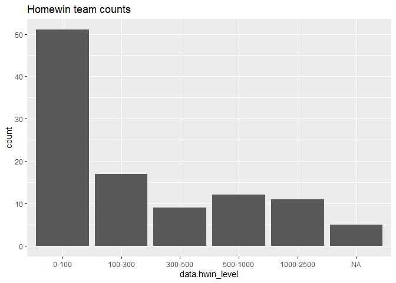
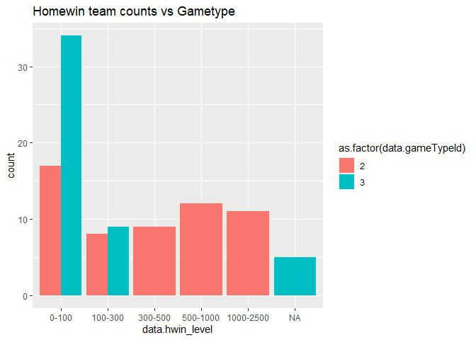
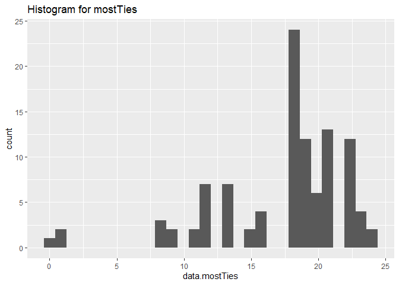
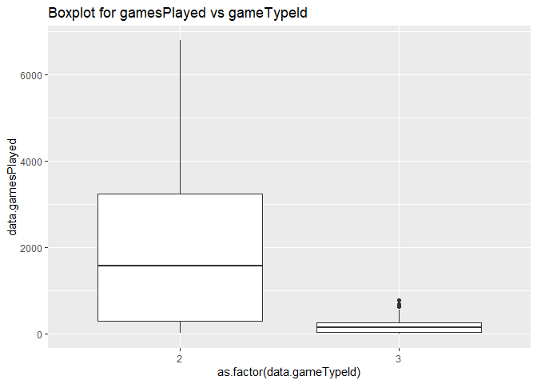
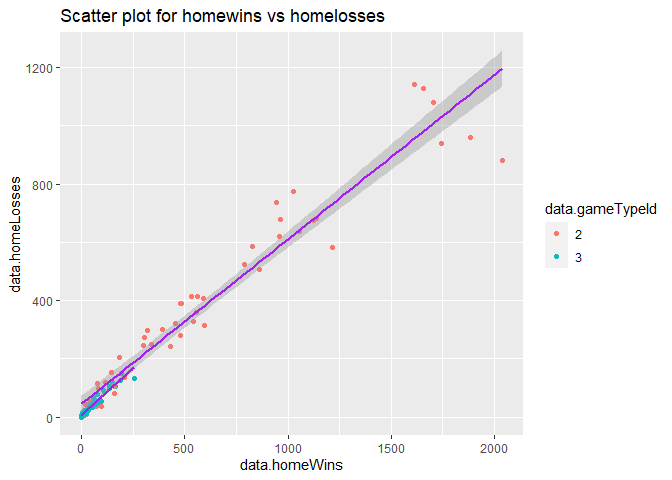

Project 1
================
Jingjing Li
6/13/2021

-   [Contents](#contents)
    -   [Introduction](#introduction)
    -   [Link to repo](#link-to-repo)
    -   [Required packages](#required-packages)
    -   [Functions](#functions)
        -   [NHL records API](#nhl-records-api)
        -   [NHL stats API](#nhl-stats-api)
        -   [wrapper function](#wrapper-function)
    -   [Exploratory Data analysis](#exploratory-data-analysis)
        -   [Data from two endpoints](#data-from-two-endpoints)
        -   [New variables](#new-variables)
        -   [contingency tables](#contingency-tables)
        -   [numerical summary](#numerical-summary)
        -   [Five plots](#five-plots)

# Contents

## Introduction

This project aims at creating some functions to read and analyze data
from the National Hockey League’s (NHL) API.

## Link to repo

Below is the link to reach github repo.

## Required packages

Following packages are required to run the codes.  
\* httr  
\* jsonlite \* dplyr \* rmarkdown \* ggplot2 \* tidyr

## Functions

This section is going to introduce several function to contact NHL
records API for some endpoints.

### NHL records API

#### Load packages

In the first step, a couple of packages are loaded for querying (httr),
converting ((jsonlite), manipulating (dplyr), reshaping (tidyr) and
plotting data(ggplot2).

``` r
# load package to get data from API link
library(httr)
library(jsonlite)
library(dplyr)
library(ggplot2)
library(tidyr)
```

#### franchise function

Several functions including `franchise`, `total`,`season`, `goalie`,
`skater`, `detail`,`stats`are created to get access to different APIs.
If/else arguments are used for choosing ways to different links. Basic
idea is that a full url link is established by connect a base url to
modifiers which are indicated by sepecified input. `franchise`and
`total`adopt options of both`id` and `name` to access the links, others
only rely on `id`. To observe full data, both `0` and
`full`(`franchise`and `total` ) or `0`(others) are utilized. To validate
the functions, two examples are applied to each one. In terms of full
dataset, `head` function is used to show partial result. `str` function
can return overview of the structure of full dataframe which can serve
for the construction of later functions.

``` r
franchise <- function (id,name){
  base_url <- "https://records.nhl.com/site/api/franchise"
  get_url <- GET (base_url)
  record_txt <- content (get_url, "text", encoding = "UTF-8")
  record_json <- fromJSON(record_txt, flatten=TRUE)
  Data_df <- data.frame( record_json)
  if (id==0 & name == "full") {
    return(Data_df) 
  }
    else{record <- filter(Data_df, data.id==id | data.fullName==name)
    return(record)
    }
}
record_franchise1 <- franchise (2, "Montreal Wanderers")
record_franchise1
```

    ##   data.id data.firstSeasonId      data.fullName data.lastSeasonId
    ## 1       2           19171918 Montreal Wanderers          19171918
    ##   data.mostRecentTeamId data.teamAbbrev data.teamCommonName data.teamPlaceName
    ## 1                    41             MWN           Wanderers           Montreal
    ##   total
    ## 1    39

``` r
record_franchise2 <- franchise (0,"full")
head(record_franchise2)
```

    ##   data.id data.firstSeasonId       data.fullName data.lastSeasonId
    ## 1       1           19171918  Montréal Canadiens                NA
    ## 2       2           19171918  Montreal Wanderers          19171918
    ## 3       3           19171918    St. Louis Eagles          19341935
    ## 4       4           19191920     Hamilton Tigers          19241925
    ## 5       5           19171918 Toronto Maple Leafs                NA
    ## 6       6           19241925       Boston Bruins                NA
    ##   data.mostRecentTeamId data.teamAbbrev data.teamCommonName data.teamPlaceName
    ## 1                     8             MTL           Canadiens           Montréal
    ## 2                    41             MWN           Wanderers           Montreal
    ## 3                    45             SLE              Eagles          St. Louis
    ## 4                    37             HAM              Tigers           Hamilton
    ## 5                    10             TOR         Maple Leafs            Toronto
    ## 6                     6             BOS              Bruins             Boston
    ##   total
    ## 1    39
    ## 2    39
    ## 3    39
    ## 4    39
    ## 5    39
    ## 6    39

``` r
str(record_franchise2)
```

    ## 'data.frame':    39 obs. of  9 variables:
    ##  $ data.id              : int  1 2 3 4 5 6 7 8 9 10 ...
    ##  $ data.firstSeasonId   : int  19171918 19171918 19171918 19191920 19171918 19241925 19241925 19251926 19251926 19261927 ...
    ##  $ data.fullName        : chr  "Montréal Canadiens" "Montreal Wanderers" "St. Louis Eagles" "Hamilton Tigers" ...
    ##  $ data.lastSeasonId    : int  NA 19171918 19341935 19241925 NA NA 19371938 19411942 19301931 NA ...
    ##  $ data.mostRecentTeamId: int  8 41 45 37 10 6 43 51 39 3 ...
    ##  $ data.teamAbbrev      : chr  "MTL" "MWN" "SLE" "HAM" ...
    ##  $ data.teamCommonName  : chr  "Canadiens" "Wanderers" "Eagles" "Tigers" ...
    ##  $ data.teamPlaceName   : chr  "Montréal" "Montreal" "St. Louis" "Hamilton" ...
    ##  $ total                : int  39 39 39 39 39 39 39 39 39 39 ...

``` r
total <- function (id, name){
  base_url <- "https://records.nhl.com/site/api"
  full_url <- paste0 (base_url, "/franchise-team-totals")
  get_url <- GET (full_url)
  record_txt <- content (get_url, "text", encoding = "UTF-8")
  record_json <- fromJSON(record_txt, flatten=TRUE)
  Data_df <- data.frame( record_json)
  if (id==0 & name == "full") {
    return(Data_df) 
  }
    else{record <- filter(Data_df, data.franchiseId==id|
         data.teamName==name)
    }
  return(record)
}
record_total1 <- total (2, "Montreal Wanderers")
record_total1
```

    ##   data.id data.activeFranchise data.firstSeasonId data.franchiseId
    ## 1      79                    0           19171918                2
    ##   data.gameTypeId data.gamesPlayed data.goalsAgainst data.goalsFor
    ## 1               2                6                37            17
    ##   data.homeLosses data.homeOvertimeLosses data.homeTies data.homeWins
    ## 1               2                      NA             0             1
    ##   data.lastSeasonId data.losses data.overtimeLosses data.penaltyMinutes
    ## 1          19171918           5                  NA                  27
    ##   data.pointPctg data.points data.roadLosses data.roadOvertimeLosses
    ## 1         0.1667           2               3                      NA
    ##   data.roadTies data.roadWins data.shootoutLosses data.shootoutWins
    ## 1             0             0                   0                 0
    ##   data.shutouts data.teamId      data.teamName data.ties data.triCode data.wins
    ## 1             0          41 Montreal Wanderers         0          MWN         1
    ##   total
    ## 1   105

``` r
record_total2 <- total (0, "full")
head(record_total2)
```

    ##   data.id data.activeFranchise data.firstSeasonId data.franchiseId
    ## 1       1                    1           19821983               23
    ## 2       2                    1           19821983               23
    ## 3       3                    1           19721973               22
    ## 4       4                    1           19721973               22
    ## 5       5                    1           19261927               10
    ## 6       6                    1           19261927               10
    ##   data.gameTypeId data.gamesPlayed data.goalsAgainst data.goalsFor
    ## 1               2             2993              8902          8792
    ## 2               3              257               634           697
    ## 3               2             3788             11907         12045
    ## 4               3              310               899           986
    ## 5               2             6560             20020         20041
    ## 6               3              518              1447          1404
    ##   data.homeLosses data.homeOvertimeLosses data.homeTies data.homeWins
    ## 1             525                      85            96           790
    ## 2              53                       0            NA            74
    ## 3             678                      84           170           963
    ## 4              53                       1            NA            95
    ## 5            1143                      76           448          1614
    ## 6             104                       0             1           137
    ##   data.lastSeasonId data.losses data.overtimeLosses data.penaltyMinutes
    ## 1                NA        1211                 169               44773
    ## 2                NA         120                   0                4266
    ## 3                NA        1587                 166               57792
    ## 4                NA         139                   0                5693
    ## 5                NA        2716                 153               86129
    ## 6                NA         266                   0                8181
    ##   data.pointPctg data.points data.roadLosses data.roadOvertimeLosses
    ## 1         0.5306        3176             686                      84
    ## 2         0.0039           2              67                       0
    ## 3         0.5133        3889             909                      82
    ## 4         0.0129           8              86                       2
    ## 5         0.5127        6727            1573                      77
    ## 6         0.0000           0             162                       0
    ##   data.roadTies data.roadWins data.shootoutLosses data.shootoutWins
    ## 1           123           604                  84                78
    ## 2            NA            63                   0                 0
    ## 3           177           725                  70                86
    ## 4            NA            76                   0                 0
    ## 5           360          1269                  68                79
    ## 6             7           107                   0                 0
    ##   data.shutouts data.teamId      data.teamName data.ties data.triCode data.wins
    ## 1           196           1  New Jersey Devils       219          NJD      1394
    ## 2            25           1  New Jersey Devils        NA          NJD       137
    ## 3           177           2 New York Islanders       347          NYI      1688
    ## 4            12           2 New York Islanders        NA          NYI       171
    ## 5           408           3   New York Rangers       808          NYR      2883
    ## 6            44           3   New York Rangers         8          NYR       244
    ##   total
    ## 1   105
    ## 2   105
    ## 3   105
    ## 4   105
    ## 5   105
    ## 6   105

#### season function

``` r
season <- function (id){
  base_url <- "https://records.nhl.com/site/api/franchise-season-records?cayenneExp=franchiseId"
  if (id==0 ) {
    get_url <- GET (base_url) 
    record_txt <- content (get_url , "text", encoding = "UTF-8")
    record_json <- fromJSON(record_txt, flatten=TRUE)
    Data_df <- data.frame(record_json)
    return(Data_df)
  }
    else {
      full_url  <-  paste0(base_url,"=",id )    
      get_url <- GET (full_url)
      record_txt <- content (get_url , "text", encoding = "UTF-8")
      record_json <- fromJSON(record_txt, flatten=TRUE)
      Data_df <- data.frame(record_json)
      return( Data_df)
    }
}
record_season1 <- season (9)
record_season1  
```

    ##   data.id data.fewestGoals data.fewestGoalsAgainst
    ## 1      38               NA                      NA
    ##   data.fewestGoalsAgainstSeasons data.fewestGoalsSeasons data.fewestLosses
    ## 1                             NA                      NA                NA
    ##   data.fewestLossesSeasons data.fewestPoints data.fewestPointsSeasons
    ## 1                       NA                NA                       NA
    ##   data.fewestTies data.fewestTiesSeasons data.fewestWins data.fewestWinsSeasons
    ## 1              NA                     NA              NA                     NA
    ##   data.franchiseId   data.franchiseName data.homeLossStreak
    ## 1                9 Philadelphia Quakers                   8
    ##    data.homeLossStreakDates data.homePointStreak
    ## 1 Nov 29 1930 - Jan 08 1931                    5
    ##                              data.homePointStreakDates data.homeWinStreak
    ## 1 Jan 15 1926 - Feb 13 1926, Feb 23 1926 - Mar 15 1926                  5
    ##                                data.homeWinStreakDates data.homeWinlessStreak
    ## 1 Jan 15 1926 - Feb 13 1926, Feb 23 1926 - Mar 15 1926                      8
    ##   data.homeWinlessStreakDates data.lossStreak      data.lossStreakDates
    ## 1   Nov 29 1930 - Jan 08 1931              15 Nov 29 1930 - Jan 08 1931
    ##   data.mostGameGoals      data.mostGameGoalsDates data.mostGoals
    ## 1                 10 Nov 19 1929 - TOR 5 @ PIR 10            102
    ##   data.mostGoalsAgainst data.mostGoalsAgainstSeasons data.mostGoalsSeasons
    ## 1                   185                 1929-30 (44)          1929-30 (44)
    ##   data.mostLosses     data.mostLossesSeasons data.mostPenaltyMinutes
    ## 1              36 1929-30 (44), 1930-31 (44)                     503
    ##   data.mostPenaltyMinutesSeasons data.mostPoints data.mostPointsSeasons
    ## 1                   1930-31 (44)              46           1927-28 (44)
    ##   data.mostShutouts   data.mostShutoutsSeasons data.mostTies
    ## 1                11 1927-28 (44), 1928-29 (44)             8
    ##         data.mostTiesSeasons data.mostWins       data.mostWinsSeasons
    ## 1 1927-28 (44), 1928-29 (44)            19 1925-26 (36), 1927-28 (44)
    ##   data.pointStreak     data.pointStreakDates data.roadLossStreak
    ## 1                6 Mar 10 1928 - Mar 24 1928                  12
    ##                               data.roadLossStreakDates data.roadPointStreak
    ## 1 Nov 26 1929 - Jan 21 1930, Nov 15 1930 - Jan 22 1931                    6
    ##   data.roadPointStreakDates data.roadWinStreak
    ## 1 Jan 24 1928 - Feb 16 1928                  4
    ##                                data.roadWinStreakDates data.roadWinlessStreak
    ## 1 Jan 01 1927 - Jan 20 1927, Jan 31 1928 - Feb 14 1928                     22
    ##   data.roadWinlessStreakDates data.winStreak       data.winStreakDates
    ## 1   Nov 26 1929 - Mar 13 1930              6 Mar 10 1928 - Mar 24 1928
    ##   data.winlessStreak   data.winlessStreakDates total
    ## 1                 16 Feb 04 1930 - Mar 18 1930     1

``` r
record_season2 <- season (0)
head(record_season2)
```

    ##   data.id data.fewestGoals data.fewestGoalsAgainst
    ## 1       1              174                     164
    ## 2       2              170                     190
    ## 3       3              150                     177
    ## 4       4              173                     164
    ## 5       5              182                     188
    ## 6       6              147                     172
    ##   data.fewestGoalsAgainstSeasons data.fewestGoalsSeasons data.fewestLosses
    ## 1                   2003-04 (82)            2010-11 (82)                19
    ## 2                   1975-76 (80)            1972-73 (78)                15
    ## 3                   1970-71 (78)            1954-55 (70)                17
    ## 4                   1973-74 (78)            1967-68 (74)                12
    ## 5                   1997-98 (82)            1969-70 (76)                21
    ## 6                   1952-53 (70)            1955-56 (70)                13
    ##     data.fewestLossesSeasons data.fewestPoints data.fewestPointsSeasons
    ## 1               2000-01 (82)                36             1975-76 (80)
    ## 2               1978-79 (80)                30             1972-73 (78)
    ## 3               1971-72 (78)                47             1965-66 (70)
    ## 4               1979-80 (80)                56             2006-07 (82)
    ## 5 1992-93 (84), 2016-17 (82)                38             1983-84 (80)
    ## 6               1971-72 (78)                38             1961-62 (70)
    ##   data.fewestTies data.fewestTiesSeasons data.fewestWins
    ## 1               3           1985-86 (80)              12
    ## 2               4           1983-84 (80)              12
    ## 3               4           2001-02 (82)              17
    ## 4               4           1985-86 (80)              17
    ## 5               4           1995-96 (82)              16
    ## 6               5           1972-73 (78)              14
    ##                     data.fewestWinsSeasons data.franchiseId  data.franchiseName
    ## 1                             1975-76 (80)               23   New Jersey Devils
    ## 2                             1972-73 (78)               22  New York Islanders
    ## 3 1952-53 (70), 1954-55 (70), 1959-60 (70)               10    New York Rangers
    ## 4                             1969-70 (76)               16 Philadelphia Flyers
    ## 5                             1983-84 (80)               17 Pittsburgh Penguins
    ## 6                             1962-63 (70)                6       Boston Bruins
    ##   data.homeLossStreak                             data.homeLossStreakDates
    ## 1                  10                            Jan 26 2021 - Mar 13 2021
    ## 2                   7 Nov 13 1999 - Dec 14 1999, Feb 27 2001 - Mar 29 2001
    ## 3                   7 Oct 20 1976 - Nov 14 1976, Mar 24 1993 - Apr 14 1993
    ## 4                   8                            Dec 09 2006 - Jan 27 2007
    ## 5                  14                            Dec 31 2003 - Feb 22 2004
    ## 6                  11                            Dec 08 1924 - Feb 17 1925
    ##   data.homePointStreak                            data.homePointStreakDates
    ## 1                   15 Jan 08 1997 - Mar 15 1997, Dec 14 1999 - Feb 17 2000
    ## 2                   23 Oct 17 1978 - Jan 20 1979, Jan 02 1982 - Apr 03 1982
    ## 3                   24 Oct 14 1970 - Jan 31 1971, Oct 24 1995 - Feb 15 1996
    ## 4                   26                            Oct 11 1979 - Feb 03 1980
    ## 5                   20                            Nov 30 1974 - Feb 22 1975
    ## 6                   27                            Nov 22 1970 - Mar 20 1971
    ##   data.homeWinStreak   data.homeWinStreakDates data.homeWinlessStreak
    ## 1                 11 Feb 09 2009 - Mar 20 2009                     14
    ## 2                 14 Jan 02 1982 - Feb 25 1982                      9
    ## 3                 14 Dec 19 1939 - Feb 25 1940                     10
    ## 4                 20 Jan 04 1976 - Apr 03 1976                     13
    ## 5                 13 Nov 15 2013 - Jan 15 2014                     16
    ## 6                 20 Dec 03 1929 - Mar 18 1930                     11
    ##                            data.homeWinlessStreakDates data.lossStreak
    ## 1 Feb 12 1976 - Mar 30 1976, Feb 04 1979 - Mar 31 1979              14
    ## 2                            Mar 02 1999 - Apr 06 1999              12
    ## 3                            Jan 30 1944 - Mar 19 1944              11
    ## 4                            Nov 29 2006 - Feb 08 2007               9
    ## 5                            Dec 31 2003 - Mar 04 2004              13
    ## 6                            Dec 08 1924 - Feb 17 1925              11
    ##                                   data.lossStreakDates data.mostGameGoals
    ## 1                            Dec 30 1975 - Jan 29 1976                  9
    ## 2 Dec 27 1972 - Jan 16 1973, Nov 22 1988 - Dec 15 1988                 11
    ## 3                            Oct 30 1943 - Nov 27 1943                 12
    ## 4                            Dec 08 2006 - Dec 27 2006                 13
    ## 5                            Jan 13 2004 - Feb 12 2004                 12
    ## 6                            Dec 03 1924 - Jan 05 1925                 14
    ##                                                                                                                                                                                                                                               data.mostGameGoalsDates
    ## 1 Apr 01 1979 - STL 5 @ CLR 9, Feb 12 1982 - QUE 2 @ CLR 9, Apr 06 1986 - NYI 7 @ NJD 9, Mar 10 1990 - QUE 3 @ NJD 9, Dec 05 1990 - VAN 4 @ NJD 9, Oct 26 1991 - SJS 0 @ NJD 9, Mar 23 1993 - TBL 3 @ NJD 9, Mar 10 2000 - NJD 9 @ ATL 0, Oct 28 2000 - NJD 9 @ PIT 0
    ## 2                                                                                                                                                                                                          Dec 20 1983 - PIT 3 @ NYI 11, Mar 03 1984 - NYI 11 @ TOR 6
    ## 3                                                                                                                                                                                                                                        Nov 21 1971 - CGS 1 @ NYR 12
    ## 4                                                                                                                                                                                                          Mar 22 1984 - PIT 4 @ PHI 13, Oct 18 1984 - VAN 2 @ PHI 13
    ## 5                                                                                                                                                                                                          Mar 15 1975 - WSH 1 @ PIT 12, Dec 26 1991 - TOR 1 @ PIT 12
    ## 6                                                                                                                                                                                                                                        Jan 21 1945 - NYR 3 @ BOS 14
    ##   data.mostGoals data.mostGoalsAgainst data.mostGoalsAgainstSeasons
    ## 1            308                   374                 1985-86 (80)
    ## 2            385                   347                 1972-73 (78)
    ## 3            321                   345                 1984-85 (80)
    ## 4            350                   319                 1992-93 (84)
    ## 5            367                   394                 1982-83 (80)
    ## 6            399                   306                 1961-62 (70)
    ##   data.mostGoalsSeasons data.mostLosses     data.mostLossesSeasons
    ## 1          1992-93 (84)              56 1975-76 (80), 1983-84 (80)
    ## 2          1981-82 (80)              60               1972-73 (78)
    ## 3          1991-92 (80)              44               1984-85 (80)
    ## 4          1983-84 (80)              48               2006-07 (82)
    ## 5          1992-93 (84)              58               1983-84 (80)
    ## 6          1970-71 (78)              47 1961-62 (70), 1996-97 (82)
    ##   data.mostPenaltyMinutes data.mostPenaltyMinutesSeasons data.mostPoints
    ## 1                    2494                   1988-89 (80)             111
    ## 2                    1857                   1986-87 (80)             118
    ## 3                    2021                   1989-90 (80)             113
    ## 4                    2621                   1980-81 (80)             118
    ## 5                    2674                   1988-89 (80)             119
    ## 6                    2443                   1987-88 (80)             121
    ##   data.mostPointsSeasons data.mostShutouts data.mostShutoutsSeasons
    ## 1           2000-01 (82)                14             2003-04 (82)
    ## 2           1981-82 (80)                11             2018-19 (82)
    ## 3           2014-15 (82)                13             1928-29 (44)
    ## 4           1975-76 (80)                13             1974-75 (80)
    ## 5           1992-93 (84)                10             2014-15 (82)
    ## 6           1970-71 (78)                15             1927-28 (44)
    ##   data.mostTies data.mostTiesSeasons data.mostWins       data.mostWinsSeasons
    ## 1            21         1977-78 (80)            51               2008-09 (82)
    ## 2            22         1974-75 (80)            54               1981-82 (80)
    ## 3            21         1950-51 (70)            53               2014-15 (82)
    ## 4            24         1969-70 (76)            53 1984-85 (80), 1985-86 (80)
    ## 5            20         1970-71 (78)            56               1992-93 (84)
    ## 6            21         1954-55 (70)            57               1970-71 (78)
    ##   data.pointStreak     data.pointStreakDates data.roadLossStreak
    ## 1               16 Dec 26 1999 - Jan 28 2000                  12
    ## 2               17 Oct 12 2019 - Nov 23 2019                  15
    ## 3               19 Nov 23 1939 - Jan 13 1940                  10
    ## 4               35 Oct 14 1979 - Jan 06 1980                   8
    ## 5               18 Mar 09 1993 - Apr 14 1993                  18
    ## 6               23 Dec 22 1940 - Feb 23 1941                  14
    ##                               data.roadLossStreakDates data.roadPointStreak
    ## 1                            Oct 19 1983 - Dec 01 1983                   10
    ## 2                            Jan 20 1973 - Mar 31 1973                    8
    ## 3 Oct 30 1943 - Dec 23 1943, Feb 08 1961 - Mar 15 1961                   11
    ## 4 Oct 25 1972 - Nov 26 1972, Mar 03 1988 - Mar 29 1988                   16
    ## 5                            Dec 23 1982 - Mar 04 1983                    8
    ## 6                            Dec 27 1964 - Feb 21 1965                   16
    ##                                                                                    data.roadPointStreakDates
    ## 1                                                       Feb 27 2001 - Apr 07 2001, Jan 30 2007 - Mar 15 2007
    ## 2 Feb 12 1976 - Mar 14 1976, Nov 12 1978 - Dec 09 1978, Feb 27 1981 - Mar 29 1981, Oct 07 1981 - Nov 11 1981
    ## 3                                                                                  Nov 05 1939 - Jan 13 1940
    ## 4                                                                                  Oct 20 1979 - Jan 06 1980
    ## 5                                                       Jan 13 2007 - Feb 16 2007, Mar 11 2016 - Apr 07 2016
    ## 6                                                                                  Jan 11 2014 - Mar 30 2014
    ##   data.roadWinStreak   data.roadWinStreakDates data.roadWinlessStreak
    ## 1                 10 Feb 27 2001 - Apr 07 2001                     32
    ## 2                  8 Feb 27 1981 - Mar 29 1981                     20
    ## 3                  9 Jan 16 2020 - Feb 27 2020                     16
    ## 4                  8 Dec 22 1982 - Jan 16 1983                     19
    ## 5                  8 Mar 11 2016 - Apr 07 2016                     18
    ## 6                  9 Mar 02 2014 - Mar 30 2014                     14
    ##                                                       data.roadWinlessStreakDates
    ## 1                                                       Nov 12 1977 - Mar 15 1978
    ## 2                                                       Nov 03 1972 - Jan 13 1973
    ## 3                                                       Oct 09 1952 - Dec 20 1952
    ## 4                                                       Oct 23 1971 - Jan 27 1972
    ## 5                            Oct 25 1970 - Jan 14 1971, Dec 23 1982 - Mar 04 1983
    ## 6 Oct 12 1963 - Dec 14 1963, Dec 27 1964 - Feb 21 1965, Nov 09 1966 - Jan 07 1967
    ##   data.winStreak                                  data.winStreakDates
    ## 1             13                            Feb 26 2001 - Mar 23 2001
    ## 2             15                            Jan 21 1982 - Feb 20 1982
    ## 3             10 Dec 19 1939 - Jan 13 1940, Jan 19 1973 - Feb 10 1973
    ## 4             13                            Oct 19 1985 - Nov 17 1985
    ## 5             17                            Mar 09 1993 - Apr 10 1993
    ## 6             14                            Dec 03 1929 - Jan 09 1930
    ##   data.winlessStreak                              data.winlessStreakDates total
    ## 1                 27                            Feb 12 1976 - Apr 04 1976    39
    ## 2                 15                            Nov 22 1972 - Dec 21 1972    39
    ## 3                 21                            Jan 23 1944 - Mar 19 1944    39
    ## 4                 12                            Feb 24 1999 - Mar 16 1999    39
    ## 5                 18 Jan 02 1983 - Feb 10 1983, Jan 13 2004 - Feb 22 2004    39
    ## 6                 20                            Jan 28 1962 - Mar 11 1962    39

#### goalie function

``` r
goalie<- function (id){
  base_url <- "https://records.nhl.com/site/api/franchise-goalie-records?cayenneExp=franchiseId"
  if (id==0 ) {
    get_url <- GET (base_url) 
    record_txt <- content (get_url , "text", encoding = "UTF-8")
    record_json <- fromJSON(record_txt, flatten=TRUE)
    Data_df <- data.frame(record_json)
    return(Data_df)
  }
    else {
      full_url  <-  paste0(base_url,"=",id )    
      get_url <- GET (full_url)
      record_txt <- content (get_url , "text", encoding = "UTF-8")
      record_json <- fromJSON(record_txt, flatten=TRUE)
      Data_df <- data.frame(record_json)
      return(Data_df)
    }
}
record_goalie1<- goalie (6)
head(record_goalie1)
```

    ##   data.id data.activePlayer data.firstName data.franchiseId data.franchiseName
    ## 1     347             FALSE           Yves                6      Boston Bruins
    ## 2     352             FALSE         Daniel                6      Boston Bruins
    ## 3     356             FALSE          Craig                6      Boston Bruins
    ## 4     374             FALSE            Jon                6      Boston Bruins
    ## 5     380             FALSE            Tim                6      Boston Bruins
    ## 6     427             FALSE         Gilles                6      Boston Bruins
    ##   data.gameTypeId data.gamesPlayed data.lastName data.losses
    ## 1               2                8      Belanger           0
    ## 2               2                8    Berthiaume           4
    ## 3               2               35    Billington          14
    ## 4               2               57         Casey          15
    ## 5               2                2     Cheveldae           1
    ## 6               2              277       Gilbert          73
    ##   data.mostGoalsAgainstDates data.mostGoalsAgainstOneGame data.mostSavesDates
    ## 1                 1979-10-23                            5          1979-11-02
    ## 2     1992-03-08, 1992-01-25                            4          1992-03-07
    ## 3                 1995-10-14                            6          1996-01-13
    ## 4                 1993-11-24                            7          1994-03-14
    ## 5                 1997-01-13                            4          1997-01-13
    ## 6     1976-03-09, 1974-10-10                            9          1975-02-01
    ##   data.mostSavesOneGame data.mostShotsAgainstDates data.mostShotsAgainstOneGame
    ## 1                    24                 1979-11-02                           27
    ## 2                    26     1992-03-07, 1992-01-23                           28
    ## 3                    34                 1996-01-13                           36
    ## 4                    31                 1994-03-14                           36
    ## 5                    15                 1997-01-13                           19
    ## 6                    41                 1975-02-01                           44
    ##   data.mostShutoutsOneSeason data.mostShutoutsSeasonIds data.mostWinsOneSeason
    ## 1                          0                   19791980                      2
    ## 2                          0                   19911992                      1
    ## 3                          1                   19951996                     10
    ## 4                          4                   19931994                     30
    ## 5                          0                   19961997                      0
    ## 6                          6                   19731974                     34
    ##   data.mostWinsSeasonIds data.overtimeLosses data.playerId data.positionCode
    ## 1               19791980                  NA       8445403                 G
    ## 2               19911992                  NA       8445462                 G
    ## 3               19951996                  NA       8445470                 G
    ## 4               19931994                  NA       8446011                 G
    ## 5               19961997                  NA       8446082                 G
    ## 6               19731974                  NA       8447170                 G
    ##   data.rookieGamesPlayed data.rookieShutouts data.rookieWins data.seasons
    ## 1                     NA                  NA              NA            1
    ## 2                     NA                  NA              NA            1
    ## 3                     NA                  NA              NA            2
    ## 4                     NA                  NA              NA            1
    ## 5                     NA                  NA              NA            1
    ## 6                     NA                  NA              NA            7
    ##   data.shutouts data.ties data.wins total
    ## 1             0         3         2    51
    ## 2             0         2         1    51
    ## 3             1         3        15    51
    ## 4             4         9        30    51
    ## 5             0         0         0    51
    ## 6            16        39       155    51

``` r
record_goalie2<- goalie (0)
head(data.frame(record_goalie2))
```

    ##   data.id data.activePlayer data.firstName data.franchiseId  data.franchiseName
    ## 1     235             FALSE            Don               15        Dallas Stars
    ## 2     236             FALSE            Bob               28     Arizona Coyotes
    ## 3     237             FALSE           Tony               11  Chicago Blackhawks
    ## 4     238             FALSE          Grant               25     Edmonton Oilers
    ## 5     239             FALSE            Ron               16 Philadelphia Flyers
    ## 6     240             FALSE         Curtis               18     St. Louis Blues
    ##   data.gameTypeId data.gamesPlayed data.lastName data.losses
    ## 1               2              315       Beaupre         125
    ## 2               2              281       Essensa         114
    ## 3               2              873      Esposito         302
    ## 4               2              423          Fuhr         117
    ## 5               2              489       Hextall         172
    ## 6               2              280        Joseph          96
    ##   data.mostGoalsAgainstDates data.mostGoalsAgainstOneGame data.mostSavesDates
    ## 1                 1983-10-07                           10          1987-03-15
    ## 2     1992-12-11, 1992-10-12                            8          1989-12-29
    ## 3     1983-10-15, 1980-11-26                           10          1977-02-26
    ## 4     1984-02-05, 1982-10-12                            9          1986-03-12
    ## 5                 1987-04-05                            9          1990-12-23
    ## 6     1992-11-25, 1990-02-20                            8          1992-03-02
    ##   data.mostSavesOneGame data.mostShotsAgainstDates data.mostShotsAgainstOneGame
    ## 1                    52                 1986-03-21                           55
    ## 2                    49                 1989-12-29                           50
    ## 3                    50                 1976-12-12                           53
    ## 4                    49                 1986-03-12                           54
    ## 5                    45                 1988-10-13                           50
    ## 6                    51                 1992-03-02                           54
    ##   data.mostShutoutsOneSeason   data.mostShutoutsSeasonIds
    ## 1                          1 19841985, 19851986, 19861987
    ## 2                          5                     19911992
    ## 3                         15                     19691970
    ## 4                          4                     19871988
    ## 5                          5                     19961997
    ## 6                          2                     19911992
    ##   data.mostWinsOneSeason data.mostWinsSeasonIds data.overtimeLosses
    ## 1                     25               19851986                  NA
    ## 2                     33               19921993                  NA
    ## 3                     38               19691970                  NA
    ## 4                     40               19871988                  NA
    ## 5                     37               19861987                  NA
    ## 6                     36               19931994                  NA
    ##   data.playerId data.positionCode data.rookieGamesPlayed data.rookieShutouts
    ## 1       8445381                 G                     44                   0
    ## 2       8446719                 G                     36                   1
    ## 3       8446720                 G                     63                  15
    ## 4       8446991                 G                     48                   0
    ## 5       8447775                 G                     66                   1
    ## 6       8448382                 G                     30                   0
    ##   data.rookieWins data.seasons data.shutouts data.ties data.wins total
    ## 1              18            9             3        45       126  1078
    ## 2              18            7            14        32       116  1078
    ## 3              38           15            74       148       418  1078
    ## 4              28           10             9        54       226  1078
    ## 5              37           11            18        58       240  1078
    ## 6              16            6             5        34       137  1078

#### skater function

``` r
skater <- function (id,...){
  base_url <- "https://records.nhl.com/site/api/franchise-skater-records?cayenneExp=franchiseId"
  if (id==0 ) {
    get_url <- GET (base_url) 
    record_txt <- content (get_url , "text", encoding = "UTF-8")
    record_json <- fromJSON(record_txt, flatten=TRUE)
    Data_df <- data.frame(record_json)
    return(Data_df)
  }
    else {
      full_url  <-  paste0(base_url,"=",id )    
      get_url <- GET (full_url)
      record_txt <- content (get_url , "text", encoding = "UTF-8")
      record_json <- fromJSON(record_txt, flatten=TRUE)
      Data_df <- data.frame(record_json)
      return(Data_df)
    }
}
record_skater1 <- skater( 2 )
head(record_skater1)
```

    ##   data.id data.activePlayer data.assists data.firstName data.franchiseId
    ## 1   16897             FALSE            0          Gerry                2
    ## 2   16903             FALSE            0           Jack                2
    ## 3   16908             FALSE            0         George                2
    ## 4   16917             FALSE            0         Raymie                2
    ## 5   16920             FALSE            0            Ken                2
    ## 6   16889             FALSE            0          Billy                2
    ##   data.franchiseName data.gameTypeId data.gamesPlayed data.goals data.lastName
    ## 1 Montreal Wanderers               2                4          0         Geran
    ## 2 Montreal Wanderers               2                1          0         Marks
    ## 3 Montreal Wanderers               2                4          0       O'Grady
    ## 4 Montreal Wanderers               2                1          0       Skilton
    ## 5 Montreal Wanderers               2                1          0      Thompson
    ## 6 Montreal Wanderers               2                2          1          Bell
    ##                        data.mostAssistsGameDates data.mostAssistsOneGame
    ## 1 1917-12-19, 1917-12-22, 1917-12-26, 1917-12-29                       0
    ## 2                                     1917-12-29                       0
    ## 3 1917-12-19, 1917-12-22, 1917-12-26, 1917-12-29                       0
    ## 4 1917-12-19, 1917-12-22, 1917-12-26, 1917-12-29                       0
    ## 5 1917-12-19, 1917-12-22, 1917-12-26, 1917-12-29                       0
    ## 6                         1917-12-19, 1917-12-29                       0
    ##   data.mostAssistsOneSeason data.mostAssistsSeasonIds
    ## 1                         0                  19171918
    ## 2                         0                  19171918
    ## 3                         0                  19171918
    ## 4                         0                  19171918
    ## 5                         0                  19171918
    ## 6                         0                  19171918
    ##                          data.mostGoalsGameDates data.mostGoalsOneGame
    ## 1 1917-12-19, 1917-12-22, 1917-12-26, 1917-12-29                     0
    ## 2                                     1917-12-29                     0
    ## 3 1917-12-19, 1917-12-22, 1917-12-26, 1917-12-29                     0
    ## 4 1917-12-19, 1917-12-22, 1917-12-26, 1917-12-29                     0
    ## 5 1917-12-19, 1917-12-22, 1917-12-26, 1917-12-29                     0
    ## 6                                     1917-12-19                     1
    ##   data.mostGoalsOneSeason data.mostGoalsSeasonIds
    ## 1                       0                19171918
    ## 2                       0                19171918
    ## 3                       0                19171918
    ## 4                       0                19171918
    ## 5                       0                19171918
    ## 6                       1                19171918
    ##   data.mostPenaltyMinutesOneSeason data.mostPenaltyMinutesSeasonIds
    ## 1                                0                         19171918
    ## 2                                0                         19171918
    ## 3                                0                         19171918
    ## 4                                0                         19171918
    ## 5                                0                         19171918
    ## 6                                0                         19171918
    ##                         data.mostPointsGameDates data.mostPointsOneGame
    ## 1 1917-12-19, 1917-12-22, 1917-12-26, 1917-12-29                      0
    ## 2                                     1917-12-29                      0
    ## 3 1917-12-19, 1917-12-22, 1917-12-26, 1917-12-29                      0
    ## 4 1917-12-19, 1917-12-22, 1917-12-26, 1917-12-29                      0
    ## 5 1917-12-19, 1917-12-22, 1917-12-26, 1917-12-29                      0
    ## 6                                     1917-12-19                      1
    ##   data.mostPointsOneSeason data.mostPointsSeasonIds data.penaltyMinutes
    ## 1                        0                 19171918                   0
    ## 2                        0                 19171918                   0
    ## 3                        0                 19171918                   0
    ## 4                        0                 19171918                   0
    ## 5                        0                 19171918                   0
    ## 6                        1                 19171918                   0
    ##   data.playerId data.points data.positionCode data.rookieGamesPlayed
    ## 1       8446580           0                 C                      4
    ## 2       8447616           0                 L                      1
    ## 3       8448052           0                 D                      4
    ## 4       8449048           0                 D                      1
    ## 5       8449231           0                 L                      1
    ## 6       8445044           1                 C                      2
    ##   data.rookiePoints data.seasons total
    ## 1                 0            1    11
    ## 2                 0            1    11
    ## 3                 0            1    11
    ## 4                 0            1    11
    ## 5                 0            1    11
    ## 6                 1            1    11

``` r
record_skater1 <- skater( 0 )
head(data.frame(record_skater1))
```

    ##   data.id data.activePlayer data.assists data.firstName data.franchiseId
    ## 1   16888             FALSE          417         George                5
    ## 2   16889             FALSE            0          Billy                2
    ## 3   16890             FALSE          794         Johnny                6
    ## 4   16891             FALSE          712           Jean                1
    ## 5   16892             FALSE         1111            Ray                6
    ## 6   16893             FALSE           33         Harold                9
    ##     data.franchiseName data.gameTypeId data.gamesPlayed data.goals
    ## 1  Toronto Maple Leafs               2             1188        296
    ## 2   Montreal Wanderers               2                2          1
    ## 3        Boston Bruins               2             1436        545
    ## 4   Montréal Canadiens               2             1125        507
    ## 5        Boston Bruins               2             1518        395
    ## 6 Philadelphia Quakers               2              216         60
    ##   data.lastName
    ## 1     Armstrong
    ## 2          Bell
    ## 3         Bucyk
    ## 4      Beliveau
    ## 5       Bourque
    ## 6       Darragh
    ##                                                                                    data.mostAssistsGameDates
    ## 1 1956-01-07, 1957-03-16, 1957-11-24, 1961-01-15, 1961-12-02, 1962-02-25, 1964-02-23, 1965-12-18, 1969-01-31
    ## 2                                                                                     1917-12-19, 1917-12-29
    ## 3                                                                                                 1971-01-01
    ## 4                                                 1955-02-19, 1956-12-01, 1962-11-24, 1965-11-20, 1967-12-28
    ## 5                                                                                     1990-02-18, 1994-01-02
    ## 6                                                 1926-01-19, 1929-11-19, 1929-11-23, 1929-12-10, 1930-01-18
    ##   data.mostAssistsOneGame data.mostAssistsOneSeason data.mostAssistsSeasonIds
    ## 1                       3                        35                  19651966
    ## 2                       0                         0                  19171918
    ## 3                       5                        65                  19701971
    ## 4                       4                        58                  19601961
    ## 5                       5                        73                  19901991
    ## 6                       2                        17                  19291930
    ##                                                              data.mostGoalsGameDates
    ## 1                                                             1959-03-15, 1961-12-16
    ## 2                                                                         1917-12-19
    ## 3                                                             1973-01-18, 1974-01-05
    ## 4                                                 1955-11-05, 1959-03-07, 1969-02-11
    ## 5                                                                         1983-03-08
    ## 6 1927-03-20, 1928-03-12, 1928-03-17, 1929-11-16, 1930-01-18, 1930-02-01, 1930-02-22
    ##   data.mostGoalsOneGame data.mostGoalsOneSeason data.mostGoalsSeasonIds
    ## 1                     3                      23                19591960
    ## 2                     1                       1                19171918
    ## 3                     4                      51                19701971
    ## 4                     4                      47                19551956
    ## 5                     3                      31                19831984
    ## 6                     2                      15                19291930
    ##   data.mostPenaltyMinutesOneSeason data.mostPenaltyMinutesSeasonIds
    ## 1                               97                         19551956
    ## 2                                0                         19171918
    ## 3                               57                         19571958
    ## 4                              143                         19551956
    ## 5                               96                         19801981
    ## 6                                8               19271928, 19291930
    ##                                     data.mostPointsGameDates
    ## 1 1957-03-16, 1962-02-25, 1964-12-12, 1965-03-21, 1967-11-02
    ## 2                                                 1917-12-19
    ## 3                                     1970-12-10, 1971-02-25
    ## 4                                                 1959-03-07
    ## 5                                                 1990-02-18
    ## 6                                                 1930-01-18
    ##   data.mostPointsOneGame data.mostPointsOneSeason data.mostPointsSeasonIds
    ## 1                      4                       53                 19611962
    ## 2                      1                        1                 19171918
    ## 3                      6                      116                 19701971
    ## 4                      7                       91                 19581959
    ## 5                      6                       96                 19831984
    ## 6                      4                       32                 19291930
    ##   data.penaltyMinutes data.playerId data.points data.positionCode
    ## 1                 726       8444971         713                 R
    ## 2                   0       8445044           1                 C
    ## 3                 436       8445240        1339                 L
    ## 4                1033       8445408        1219                 C
    ## 5                1087       8445621        1506                 D
    ## 6                  32       8445843          93                 L
    ##   data.rookieGamesPlayed data.rookiePoints data.seasons total
    ## 1                     52                25           21 17209
    ## 2                      2                 1            1 17209
    ## 3                     NA                NA           21 17209
    ## 4                     44                34           20 17209
    ## 5                     80                65           21 17209
    ## 6                     35                17            6 17209

#### detail function

``` r
detail<- function (id,...){
  base_url <- "https://records.nhl.com/site/api/franchise-detail?cayenneExp=mostRecentTeamId"
  if (id==0 ) {
    get_url <- GET (base_url) 
    record_txt <- content (get_url , "text", encoding = "UTF-8")
    record_json <- fromJSON(record_txt, flatten=TRUE)
    Data_df <- data.frame(record_json)
    return( list(base_url,Data_df))
  }
    else {
      full_url  <-  paste0(base_url,"=",id )    
      get_url <- GET (full_url)
      record_txt <- content (get_url , "text", encoding = "UTF-8")
      record_json <- fromJSON(record_txt, flatten=TRUE)
      Data_df <- data.frame(record_json)
      return( list(full_url,Data_df))
    }
}
record_detail <- detail( 1 )
record_detail
```

    ## [[1]]
    ## [1] "https://records.nhl.com/site/api/franchise-detail?cayenneExp=mostRecentTeamId=1"
    ## 
    ## [[2]]
    ##   data.id data.active
    ## 1      23        TRUE
    ##                                                                                                                                                                                                                                                                                                                                                                                                                                                                                                                                                                                                                                                                                                                                                                                                                                                                                                                                                                                                                                                                                                                                  data.captainHistory
    ## 1 <ul class="striped-list">\r\n\t<li>(No Captain) and Nico Hischier: 2020-21</li>\r\n\t<li>Andy Greene and (No Captain): 2019-20</li>\r\n\t<li>Andy Greene: 2015-16 &ndash;&nbsp;2018-19</li>\r\n\t<li>Bryce Salvador: 2012-13 &ndash;&nbsp;2014-15</li>\r\n\t<li>Zach Parise: 2011-12</li>\r\n\t<li>Jamie Langenbrunner: 2008-09 &ndash;&nbsp;2010-11</li>\r\n\t<li>Patrik Elias and Jamie Langenbrunner: 2007-08</li>\r\n\t<li>Patrik Elias: 2006-07</li>\r\n\t<li>(No Captain): 2005-06</li>\r\n\t<li>Scott Stevens and Scott Niedermayer: 2003-04</li>\r\n\t<li>Scott Stevens: 1992-93 &ndash;&nbsp;2002-03</li>\r\n\t<li>Bruce Driver: 1991-92</li>\r\n\t<li>Kirk Muller: 1987-88 &ndash;&nbsp;1990-91</li>\r\n\t<li>Mel Bridgman: 1984-85 &ndash;&nbsp;1986-87</li>\r\n\t<li>Don Lever and Mel Bridgman: 1983-84</li>\r\n\t<li>Don Lever: 1982-83</li>\r\n\t<li>Lanny McDonald and Rob Ramage: 1981-82</li>\r\n\t<li>Lanny McDonald: 1980-81</li>\r\n\t<li>Mike Christie, Rene Robert and Lanny McDonald: 1979-80</li>\r\n\t<li>Gary Croteau: 1978-79</li>\r\n\t<li>Wilf Paiement: 1977-78</li>\r\n\t<li>Simon Nolet: 1974-75 &ndash;&nbsp;1976-77</li>\r\n</ul>\r\n
    ##                                                                                                                                                                                                                                                                                                                                                                                                                                                                                                                                                                                                                                                                                                                                                                                                                                                                                                                                                                                                                                                                                                                                                                                                                                                                                                                                                                                                                                                                                                                                                                                                                                                                                                                                                                                                                                                                                                                                                                                                                                                                                                                                                                                                                                                                                                                       data.coachingHistory
    ## 1 <ul class="striped-list">\r\n\t<li>Lindy Ruff: Present</li>\r\n\t<li>Alain Nasreddine: Dec. 3, 2019 &ndash; March 10, 2020</li>\r\n\t<li>John Hynes: Oct. 9, 2015 &ndash; Dec. 2, 2019</li>\r\n\t<li>Peter DeBoer: Oct. 8, 2011 &ndash; Dec. 23, 2014</li>\r\n\t<li>Jacques Lemaire: Dec. 23, 2010 &ndash; April 10, 2011</li>\r\n\t<li>John MacLean: Oct. 8&nbsp;&ndash; Dec. 21, 2010</li>\r\n\t<li>Jacques Lemaire: Oct. 3, 2009 &ndash; April 22, 2010</li>\r\n\t<li>Brent Sutter: Oct. 4, 2007 &ndash; April 28, 2009</li>\r\n\t<li>Lou Lamoriello: April 3&nbsp;&ndash; May 5, 2007</li>\r\n\t<li>Claude Julien: Oct. 6, 2006 &ndash; April 1, 2007</li>\r\n\t<li>Lou Lamoriello: Dec. 20, 2005 &ndash; May 14, 2006</li>\r\n\t<li>Larry Robinson: Oct. 5&nbsp;&ndash; Dec. 17, 2005</li>\r\n\t<li>Pat Burns: Oct. 10, 2002 &ndash; April 17, 2004</li>\r\n\t<li>Kevin Constantine: Jan. 29&nbsp;&ndash; April 27, 2002</li>\r\n\t<li>Larry Robinson: March 24, 2000 &ndash; Jan. 26, 2002</li>\r\n\t<li>Robbie Ftorek: Oct. 10, 1998 &ndash; March 21, 2000</li>\r\n\t<li>Jacques Lemaire: Oct. 6, 1993 &ndash; May 2, 1998</li>\r\n\t<li>Herb Brooks: Oct. 6, 1992 &ndash; April 26, 1993</li>\r\n\t<li>Tom McVie: March 5, 1991 &ndash; May 1, 1992</li>\r\n\t<li>John Cunniff: Nov. 8, 1989 &ndash; March 3, 1991</li>\r\n\t<li>Jim Schoenfeld: Jan. 28, 1988 &ndash; Nov. 4, 1989</li>\r\n\t<li>Doug Carpenter: Oct. 12, 1984 &ndash; Jan. 25, 1988</li>\r\n\t<li>Tom McVie: Nov. 23, 1983 &ndash; April 1, 1984</li>\r\n\t<li>Bill MacMillan: Oct. 5, 1982 &ndash; Nov. 19, 1983</li>\r\n\t<li>Marshall Johnston: Nov. 30, 1981 &ndash; April 3, 1982</li>\r\n\t<li>Bert Marshall: Oct. 6&nbsp;&ndash; Nov. 28, 1981</li>\r\n\t<li>Bill MacMillan: Oct. 11, 1980 &ndash; April 4, 1981</li>\r\n\t<li>Don Cherry: Oct. 11, 1979 &ndash; April 6, 1980</li>\r\n\t<li>Aldo Guidolin: Nov. 25, 1978 &ndash; April 8, 1979</li>\r\n\t<li>Pat Kelly: Oct. 14, 1977 &ndash; Nov. 23, 1978</li>\r\n\t<li>Johnny Wilson: Oct. 5, 1976 &ndash; April 3, 1977</li>\r\n\t<li>Eddie Bush: Jan. 28&nbsp;&ndash; April 4, 1976</li>\r\n\t<li>Sid Abel: Jan. 21-25, 1976</li>\r\n\t<li>Bep Guidolin: Oct. 9, 1974 &ndash; Jan. 17, 1976</li>\r\n\t<li>* <em>Date range indicates first and last games coached during tenure (regular season or playoffs)</em></li>\r\n</ul>\r\n
    ##      data.dateAwarded                               data.directoryUrl
    ## 1 1974-06-11T00:00:00 https://www.nhl.com/devils/team/staff-directory
    ##   data.firstSeasonId
    ## 1           19741975
    ##                                                                                                                                                                                                                                                                                                                                                                                                                                                                                                                                                                                            data.generalManagerHistory
    ## 1 <ul class="striped-list">\r\n\t<li>Tom Fitzgerald: Jan. 12, 2020 &ndash; Present</li>\r\n\t<li>Ray Shero: May 4, 2015 &ndash; Jan. 12, 2020</li>\r\n\t<li>Lou Lamoriello: Sept. 10, 1987 &ndash; May 4, 2015</li>\r\n\t<li>Max McNab: Nov. 22, 1983 &ndash; Sept. 10, 1987</li>\r\n\t<li>Bill MacMillan: May 4, 1981 &ndash; Nov. 22, 1983</li>\r\n\t<li>Ray Miron: Aug. 23, 1976 &ndash; May 1, 1981</li>\r\n\t<li>Baz Bastien: Feb. 14&nbsp;&ndash; April 5, 1976</li>\r\n\t<li>Sid Abel: June 1, 1973 &ndash; Feb. 13, 1976</li>\r\n\t<li>* <em>Date range indicates first and last days of tenure</em></li>\r\n</ul>\r\n
    ##                                                              data.heroImageUrl
    ## 1 https://records.nhl.com/site/asset/public/ext/hero/Team Pages/NJD/Subban.jpg
    ##   data.mostRecentTeamId
    ## 1                     1
    ##                                                                                                                                                                                                                                                                                        data.retiredNumbersSummary
    ## 1 <ul class="striped-list">\r\n\t<li>3 &ndash;&nbsp;Ken Daneyko (1982-03)</li>\r\n\t<li>4 &ndash;&nbsp;Scott Stevens (1991-05)</li>\r\n\t<li>26 &ndash;&nbsp;Patrik Elias (1996-16)</li>\r\n\t<li>27 &ndash;&nbsp;Scott Niedermayer (1991-04)</li>\r\n\t<li>30 &ndash;&nbsp;Martin Brodeur (1992-14)</li>\r\n</ul>\r\n
    ##   data.teamAbbrev data.teamFullName total
    ## 1             NJD New Jersey Devils     1

``` r
record_detail <- detail( 0 )
head(data.frame(record_detail))
```

    ##   X.https...records.nhl.com.site.api.franchise.detail.cayenneExp.mostRecentTeamId.
    ## 1    https://records.nhl.com/site/api/franchise-detail?cayenneExp=mostRecentTeamId
    ## 2    https://records.nhl.com/site/api/franchise-detail?cayenneExp=mostRecentTeamId
    ## 3    https://records.nhl.com/site/api/franchise-detail?cayenneExp=mostRecentTeamId
    ## 4    https://records.nhl.com/site/api/franchise-detail?cayenneExp=mostRecentTeamId
    ## 5    https://records.nhl.com/site/api/franchise-detail?cayenneExp=mostRecentTeamId
    ## 6    https://records.nhl.com/site/api/franchise-detail?cayenneExp=mostRecentTeamId
    ##   data.id data.active
    ## 1       1        TRUE
    ## 2       2       FALSE
    ## 3       3       FALSE
    ## 4       4       FALSE
    ## 5       5        TRUE
    ## 6       6        TRUE
    ##                                                                                                                                                                                                                                                                                                                                                                                                                                                                                                                                                                                                                                                                                                                                                                                                                                                                                                                                                                                                                                                                                                                                                                                                                                                                                                                                                                                                                                                                                                                                                                                                                                                                                                 data.captainHistory
    ## 1 <ul class="striped-list">\r\n\t<li>Shea Weber: 2018-19 &ndash; Present</li>\r\n\t<li>Max Pacioretty: 2015-16 &ndash;&nbsp;2017-18</li>\r\n\t<li>(No Captain): 2014-15</li>\r\n\t<li>Brian Gionta: 2010-11 &ndash;&nbsp;2013-14</li>\r\n\t<li>(No Captain): 2009-10</li>\r\n\t<li>Saku Koivu: 1999-00 &ndash;&nbsp;2008-09</li>\r\n\t<li>Vincent Damphousse: 1997-98 &ndash;&nbsp;1998-99</li>\r\n\t<li>Pierre Turgeon and Vincent Damphousse: 1996-97</li>\r\n\t<li>Mike Keane and Pierre Turgeon: 1995-96</li>\r\n\t<li>Kirk Muller and Mike Keane: 1994-95</li>\r\n\t<li>Guy Carbonneau: 1990-91 &ndash;&nbsp;1993-94</li>\r\n\t<li>Guy Carbonneau and Chris Chelios: 1989-90</li>\r\n\t<li>Bob Gainey: 1981-82 &ndash;&nbsp;1988-89</li>\r\n\t<li>Serge Savard: 1979-80 &ndash;&nbsp;1980-81</li>\r\n\t<li>Yvan Cournoyer and Serge Savard: 1978-79</li>\r\n\t<li>Yvan Cournoyer: 1975-76 &ndash;&nbsp;1977-78</li>\r\n\t<li>Henri Richard: 1971-72 &ndash;&nbsp;1974-75</li>\r\n\t<li>Jean Beliveau: 1961-62 &ndash;&nbsp;1970-71</li>\r\n\t<li>Doug Harvey: 1960-61</li>\r\n\t<li>Maurice Richard: 1956-57 &ndash;&nbsp;1959-60</li>\r\n\t<li>Butch Bouchard: 1948-49 &ndash;&nbsp;1955-56</li>\r\n\t<li>Toe Blake and Bill Durnan: 1947-48</li>\r\n\t<li>Toe Blake: 1940-41 &ndash;&nbsp;1946-47</li>\r\n\t<li>Walt Buswell: 1939-40</li>\r\n\t<li>Babe Siebert: 1936-37 &ndash;&nbsp;1938-39</li>\r\n\t<li>Sylvio Mantha: 1933-34 &ndash;&nbsp;1935-36</li>\r\n\t<li>George Hainsworth: 1932-33</li>\r\n\t<li>Sylvio Mantha: 1926-27 &ndash;&nbsp;1931-32</li>\r\n\t<li>Bill Coutu: 1925-26</li>\r\n\t<li>Sprague Cleghorn: 1922-23 &ndash;&nbsp;1924-25</li>\r\n\t<li>Newsy Lalonde: 1916-17&nbsp;&ndash;&nbsp;1921-22</li>\r\n</ul>\r\n
    ## 2                                                                                                                                                                                                                                                                                                                                                                                                                                                                                                                                                                                                                                                                                                                                                                                                                                                                                                                                                                                                                                                                                                                                                                                                                                                                                                                                                                                                                                                                                                                                                                                                                                                                                                              <NA>
    ## 3                                                                                                                                                                                                                                                                                                                                                                                                                                                                                                                                                                                                                                                                                                                                                                                                                                                                                                                                                                                                                                                                                                                                                                                                                                                                                                                                                                                                                                                                                                                                                                                                                                                                                                              <NA>
    ## 4                                                                                                                                                                                                                                                                                                                                                                                                                                                                                                                                                                                                                                                                                                                                                                                                                                                                                                                                                                                                                                                                                                                                                                                                                                                                                                                                                                                                                                                                                                                                                                                                                                                                                                              <NA>
    ## 5                                                             <ul class="striped-list">\r\n\t<li>John Tavares: 2019-20 &ndash;&nbsp;Present</li>\r\n\t<li>(No Captain): 2016-17 &ndash;&nbsp;2018-19</li>\r\n\t<li>Dion Phaneuf and (No Captain): 2015-16</li>\r\n\t<li>Dion Phaneuf: 2010-11 &ndash;&nbsp;2014-15</li>\r\n\t<li>(No Captain): 2008-09 &ndash;&nbsp;2009-10</li>\r\n\t<li>Mats Sundin: 1997-98 &ndash;&nbsp;2007-08</li>\r\n\t<li>Doug Gilmour: 1994-95 &ndash;&nbsp;1996-97</li>\r\n\t<li>Wendel Clark: 1991-92 &ndash;&nbsp;1993-94</li>\r\n\t<li>Rob Ramage: 1989-90 &ndash;&nbsp;1990-91</li>\r\n\t<li>(No Captain): 1986-87 &ndash;&nbsp;1988-89</li>\r\n\t<li>Rick Vaive: 1981-82 &ndash;&nbsp;1985-86</li>\r\n\t<li>Darryl Sittler: 1975-76 &ndash;&nbsp;1980-81</li>\r\n\t<li>Dave Keon: 1969-70 &ndash;&nbsp;1974-75</li>\r\n\t<li>George Armstrong: 1957-58 &ndash;&nbsp;1968-69</li>\r\n\t<li>Jimmy Thomson and Ted Kennedy: 1956-57</li>\r\n\t<li>Sid Smith: 1955-56</li>\r\n\t<li>Ted Kennedy: 1948-49 &ndash;&nbsp;1954-55</li>\r\n\t<li>Syl Apps: 1945-46 &ndash;&nbsp;1947-48</li>\r\n\t<li>Bob Davidson: 1943-44 &ndash;&nbsp;1944-45</li>\r\n\t<li>Syl Apps: 1940-41 &ndash;&nbsp;1942-43</li>\r\n\t<li>Red Horner: 1938-39 &ndash;&nbsp;1939-40</li>\r\n\t<li>Charlie Conacher: 1937-38</li>\r\n\t<li>Hap Day: 1927-28 &ndash;&nbsp;1936-37</li>\r\n\t<li>Bert Corbeau: 1926-27</li>\r\n\t<li>Babe Dye: 1925-26</li>\r\n\t<li>John Ross Roach: 1924-25</li>\r\n\t<li>Jack Adams: 1923-24</li>\r\n\t<li>Reg Noble and Jack Adams: 1922-23</li>\r\n\t<li>Reg Noble: 1920-21 &ndash;&nbsp;1921-22</li>\r\n\t<li>Frank Heffernan: 1919-20</li>\r\n\t<li>Ken Randall: 1917-18 &ndash;&nbsp;1918-19</li>\r\n</ul>\r\n
    ## 6                                                                                                                                                                                      <ul class="striped-list">\r\n\t<li>Patrice Bergeron: 2020-21 &ndash; Present</li>\r\n\t<li>Zdeno Chara: 2006-07 &ndash;&nbsp;2019-20</li>\r\n\t<li>Joe Thornton and (No Captain): 2005-06</li>\r\n\t<li>Joe Thornton: 2002-03 &ndash;&nbsp;2004-05</li>\r\n\t<li>(No Captain): 2001-02</li>\r\n\t<li>Jason Allison: 2000-01</li>\r\n\t<li>Ray&nbsp;Bourque: 1988-89 &ndash;&nbsp;1999-00</li>\r\n\t<li>Ray&nbsp;Bourque and Rick Middleton (Co-Captains): 1985-86 &ndash;&nbsp;1987-88</li>\r\n\t<li>Terry O&rsquo;Reilly: 1983-84 &ndash;&nbsp;1984-85</li>\r\n\t<li>Wayne Cashman: 1977-78 &ndash;&nbsp;1982-83</li>\r\n\t<li>Johnny Bucyk: 1973-74 &ndash;&nbsp;1976-77</li>\r\n\t<li>(No Captain): 1967-68 &ndash;&nbsp;1972-73</li>\r\n\t<li>Johnny Bucyk: 1966-67</li>\r\n\t<li>Leo Boivin: 1963-64 &ndash;&nbsp;1965-66</li>\r\n\t<li>Don McKenney: 1961-62 &ndash;&nbsp;1962-63</li>\r\n\t<li>Fern Flaman: 1955-56 &ndash;&nbsp;1960-61</li>\r\n\t<li>Milt Schmidt and Ed Sanford: 1954-55</li>\r\n\t<li>Milt Schmidt: 1950-51 &ndash;&nbsp;1953-54</li>\r\n\t<li>John Crawford: 1947-48 &ndash;&nbsp;1949-50</li>\r\n\t<li>Dit Clapper and John Crawford: 1946-47</li>\r\n\t<li>Dit Clapper: 1939-40 &ndash;&nbsp;1945-46</li>\r\n\t<li>Cooney Weiland: 1938-39</li>\r\n\t<li>Dit Clapper: 1932-33 &ndash;&nbsp;1937-38</li>\r\n\t<li>George Owen: 1931-32</li>\r\n\t<li>Lionel Hitchman: 1927-28 &ndash;&nbsp;1930-31</li>\r\n\t<li>Sprague Cleghorn: 1925-26&nbsp;&ndash;&nbsp;1926-27</li>\r\n\t<li>(No Captain): 1924-25</li>\r\n</ul>\r\n
    ##                                                                                                                                                                                                                                                                                                                                                                                                                                                                                                                                                                                                                                                                                                                                                                                                                                                                                                                                                                                                                                                                                                                                                                                                                                                                                                                                                                                                                                                                                                                                                                                                                                                                                                                                                                                                                                                                                                                                                                                                                                                                                                                                                                                                                                                                                                                                                                                                                                                                                                                                                                                                                                                                                                                                                                                                                                                                                        data.coachingHistory
    ## 1                                                                                                                                                                                                                                                                                                                                                                                           <ul class="striped-list">\r\n\t<li>Dominique Ducharme: Feb. 25, 2021&nbsp;&ndash; Present</li>\r\n\t<li>Claude Julien: Feb. 18, 2017 &ndash; Feb. 23, 2021</li>\r\n\t<li>Michel Therrien: Jan. 19, 2013 &ndash; Feb. 12, 2017</li>\r\n\t<li>Randy Cunneyworth: Dec. 17, 2011 &ndash; April 7, 2012</li>\r\n\t<li>Jacques Martin: Oct. 1, 2009 &ndash; Dec. 15, 2011</li>\r\n\t<li>Bob Gainey: March 10&nbsp;&ndash; April 22, 2009</li>\r\n\t<li>Guy Carbonneau: Oct. 6, 2006 &ndash; March 8, 2009</li>\r\n\t<li>Bob Gainey: Jan. 14&nbsp;&ndash; May 2, 2006</li>\r\n\t<li>Claude Julien: Jan. 18, 2003 &ndash; Jan. 11, 2006</li>\r\n\t<li>Michel Therrien: Nov. 21, 2000 &ndash; Jan. 16, 2003</li>\r\n\t<li>Alain Vigneault: Oct. 1, 1997 &ndash; Nov. 18, 2000</li>\r\n\t<li>Mario Tremblay: Oct. 21, 1995 &ndash; April 26, 1997</li>\r\n\t<li>Jacques Laperriere: Oct. 20, 1995</li>\r\n\t<li>Jacques Demers: Oct. 6, 1992 &ndash; Oct. 14, 1995</li>\r\n\t<li>Pat Burns: Oct. 6, 1988 &ndash; May 9, 1992</li>\r\n\t<li>Jean Perron: Oct. 10, 1985 &ndash; April 26, 1988</li>\r\n\t<li>Jacques Lemaire: Feb. 25, 1984 &ndash; May 2, 1985</li>\r\n\t<li>Bob Berry: Oct. 8, 1981 &ndash; Feb. 23, 1984</li>\r\n\t<li>Claude Ruel: Dec. 14, 1979 &ndash; April 11, 1981</li>\r\n\t<li>Bernie Geoffrion: Oct. 11&nbsp;&ndash; Dec. 11, 1979</li>\r\n\t<li>Scotty Bowman: Oct. 9, 1971 &ndash; May 21, 1979</li>\r\n\t<li>Al MacNeil: Dec. 3, 1970 &ndash; May 18, 1971</li>\r\n\t<li>Claude Ruel: Oct. 12, 1968 &ndash; Dec. 2, 1970</li>\r\n\t<li>Toe Blake: Oct. 6, 1955 &ndash; May 11, 1968</li>\r\n\t<li>Dick Irvin: Nov. 3, 1940 &ndash; April 14, 1955</li>\r\n\t<li>Pit Lepine: Nov. 5, 1939 &ndash; March 17, 1940</li>\r\n\t<li>Jules Dugal: Jan. 29&nbsp;&ndash; March 26, 1939^</li>\r\n\t<li>Cecil Hart: Nov. 7, 1936 &ndash; Jan. 24, 1939</li>\r\n\t<li>Sylvio Mantha: Nov. 12, 1935 &ndash; March 19, 1936</li>\r\n\t<li>Leo Dandurand: Jan. 1&nbsp;&ndash; March 26, 1935</li>\r\n\t<li>Newsy Lalonde: Nov. 12, 1932 &ndash; Dec. 29, 1934</li>\r\n\t<li>Cecil Hart: Nov. 16, 1926 &ndash; March 29, 1932</li>\r\n\t<li>Leo Dandurand: Jan. 11, 1922 &ndash; March 16, 1926</li>\r\n\t<li>Newsy Lalonde: Dec. 19, 1917 &ndash; Jan. 7, 1922</li>\r\n\t<li>* <em>Date range indicates first and last games coached during tenure (regular season or playoffs)</em></li>\r\n\t<li>^ <em>The Canadiens named Babe Siebert head coach in the summer of 1939, but he died before the 1939-40 season began</em></li>\r\n</ul>\r\n
    ## 2                                                                                                                                                                                                                                                                                                                                                                                                                                                                                                                                                                                                                                                                                                                                                                                                                                                                                                                                                                                                                                                                                                                                                                                                                                                                                                                                                                                                                                                                                                                                                                                                                                                                                                                                                                                                                                                                                                                                                                                                                                                                                                                                                                                                                                                                                                                                                                                                                                                                                                                                                                                                                                                                                                                                                                                                                                                                                                      <NA>
    ## 3                                                                                                                                                                                                                                                                                                                                                                                                                                                                                                                                                                                                                                                                                                                                                                                                                                                                                                                                                                                                                                                                                                                                                                                                                                                                                                                                                                                                                                                                                                                                                                                                                                                                                                                                                                                                                                                                                                                                                                                                                                                                                                                                                                                                                                                                                                                                                                                                                                                                                                                                                                                                                                                                                                                                                                                                                                                                                                      <NA>
    ## 4                                                                                                                                                                                                                                                                                                                                                                                                                                                                                                                                                                                                                                                                                                                                                                                                                                                                                                                                                                                                                                                                                                                                                                                                                                                                                                                                                                                                                                                                                                                                                                                                                                                                                                                                                                                                                                                                                                                                                                                                                                                                                                                                                                                                                                                                                                                                                                                                                                                                                                                                                                                                                                                                                                                                                                                                                                                                                                      <NA>
    ## 5 <ul class="striped-list">\r\n\t<li>Sheldon Keefe: Nov. 21, 2019 &ndash; Present</li>\r\n\t<li>Mike Babcock: Oct. 7, 2015 &ndash; Nov. 19, 2019</li>\r\n\t<li>Peter Horachek: Jan. 7&nbsp;&ndash; April 11, 2015</li>\r\n\t<li>Randy Carlyle: March 3, 2012 &ndash; Jan. 3, 2015</li>\r\n\t<li>Ron Wilson: Oct. 9, 2008 &ndash; Feb. 29, 2012</li>\r\n\t<li>Paul Maurice: Oct. 4, 2006 &ndash; April 5, 2008</li>\r\n\t<li>Pat Quinn: Oct. 10, 1998 &ndash; April 18, 2006</li>\r\n\t<li>Mike Murphy: Oct. 5, 1996 &ndash; April 19, 1998</li>\r\n\t<li>Nick Beverley: March 6&nbsp;&ndash; April 27, 1996</li>\r\n\t<li>Pat Burns: Oct. 7, 1992 &ndash; March 3, 1996</li>\r\n\t<li>Tom Watt: Oct. 27, 1990 &ndash; April 15, 1992</li>\r\n\t<li>Doug Carpenter: Oct. 5, 1989 &ndash; Oct. 25, 1990</li>\r\n\t<li>George Armstrong: Dec. 19, 1988 &ndash; April 2, 1989</li>\r\n\t<li>John Brophy: Oct. 9, 1986 &ndash; Dec. 17, 1988</li>\r\n\t<li>Dan Maloney: Oct. 11, 1984 &ndash; April 30, 1986</li>\r\n\t<li>Mike Nykoluk: Jan. 10, 1981 &ndash; April 1, 1984</li>\r\n\t<li>Joe Crozier: Oct. 11, 1980 &ndash; Jan. 7, 1981</li>\r\n\t<li>Punch Imlach: March 19&nbsp;&ndash; April 11, 1980</li>\r\n\t<li>Dick Duff: March 15-17, 1980</li>\r\n\t<li>Floyd Smith: Oct. 10, 1979 &ndash; March 12, 1980</li>\r\n\t<li>Roger Neilson: Oct. 13, 1977 &ndash; April 22, 1979</li>\r\n\t<li>Red Kelly: Oct. 10, 1973 &ndash; April 21, 1977</li>\r\n\t<li>John McLellan: Oct. 11, 1969 &ndash; April 1, 1973</li>\r\n\t<li>Punch Imlach: Nov. 29, 1958 &ndash; April 6, 1969</li>\r\n\t<li>Billy Reay: Oct. 8, 1957 &ndash; Nov. 27, 1958</li>\r\n\t<li>Howie Meeker: Oct. 11, 1956 &ndash; March 24, 1957</li>\r\n\t<li>King Clancy: Oct. 10, 1953 &ndash; March 29, 1956</li>\r\n\t<li>Joe Primeau: Oct. 14, 1950 &ndash; March 22, 1953</li>\r\n\t<li>Hap Day: Nov. 2, 1940 &ndash; April 9, 1950</li>\r\n\t<li>Dick Irvin: Dec. 1, 1931 &ndash; April 13, 1940</li>\r\n\t<li>Conn Smythe: Nov. 28, 1931</li>\r\n\t<li>Art Duncan: Nov. 18, 1930 &ndash; Nov. 26, 1931</li>\r\n\t<li>Conn Smythe: Nov. 15, 1927 &ndash; Nov. 15, 1930</li>\r\n\t<li>Alex Romeril: Feb. 17&nbsp;&ndash; March 26, 1927</li>\r\n\t<li>Mike Rodden: Feb. 12-15, 1927</li>\r\n\t<li>Charles Querrie: Nov. 17, 1926 &ndash; Feb. 10, 1927</li>\r\n\t<li>Eddie Powers: Nov. 29, 1924 &ndash; March 17, 1926</li>\r\n\t<li>Charles Querrie: Jan. 3, 1923 &ndash; March 5, 1924</li>\r\n\t<li>George O&#39;Donoghue: Dec. 17, 1921 &ndash; Dec. 30, 1922</li>\r\n\t<li>Frank Carroll: Dec. 22, 1920 &ndash; March 14, 1921</li>\r\n\t<li>Harvey Sproule: Feb. 4&nbsp;&ndash; March 13, 1920</li>\r\n\t<li>Frank Heffernan: Dec. 23, 1919 &ndash; Jan. 31, 1920</li>\r\n\t<li>Dick Carroll: Dec. 19, 1917 &ndash; Feb. 20, 1919</li>\r\n\t<li>* <em>Date range indicates first and last games coached during tenure (regular season or playoffs)</em></li>\r\n</ul>\r\n
    ## 6                                                                                                                                                                                                                                                                                                                                                                                                                                                                                                                                                                                              <ul class="striped-list">\r\n\t<li>Bruce Cassidy: Feb. 9, 2017 &ndash; Present</li>\r\n\t<li>Claude Julien: Oct. 5, 2007 &ndash; Feb. 4, 2017</li>\r\n\t<li>Dave Lewis: Oct. 6, 2006 &ndash; April 7, 2007</li>\r\n\t<li>Mike Sullivan: Oct. 8, 2003 &ndash; April 15, 2006</li>\r\n\t<li>Mike O&rsquo;Connell: March 21&nbsp;&ndash; April 17, 2003</li>\r\n\t<li>Robbie Ftorek: Oct. 4, 2001 &ndash; March 18, 2003</li>\r\n\t<li>Mike Keenan: Oct. 26, 2000 &ndash; April 7, 2001</li>\r\n\t<li>Pat Burns: Oct. 2, 1997 &ndash; Oct. 20, 2000</li>\r\n\t<li>Steve Kasper: Oct. 7, 1995 &ndash; April 13, 1997</li>\r\n\t<li>Brian Sutter: Oct. 8, 1992 &ndash; May 14, 1995</li>\r\n\t<li>Rick Bowness: Oct. 3, 1991 &ndash; May 23, 1992</li>\r\n\t<li>Mike Milbury: Oct. 5, 1989 &ndash; May 11, 1991</li>\r\n\t<li>Terry O&rsquo;Reilly: Nov. 8, 1986 &ndash; April 25, 1989</li>\r\n\t<li>Butch Goring: Oct. 10, 1985 &ndash; Nov. 5, 1986</li>\r\n\t<li>Harry Sinden: Feb. 14&nbsp;&ndash; April 16, 1985</li>\r\n\t<li>Gerry Cheevers: Oct. 9, 1980 &ndash; Feb. 10, 1985</li>\r\n\t<li>Harry Sinden: March 22&nbsp;&ndash; April 22, 1980</li>\r\n\t<li>Fred Creighton: Oct. 11, 1979 &ndash; March 19, 1980</li>\r\n\t<li>Don Cherry: Oct. 10, 1974 &ndash; May 10, 1979</li>\r\n\t<li>Bep Guidolin: Feb. 7, 1973 &ndash; May 19, 1974</li>\r\n\t<li>Tom Johnson: Oct. 11, 1970 - Feb. 4, 1973</li>\r\n\t<li>Harry Sinden: Oct. 19, 1966 &ndash; May 10, 1970</li>\r\n\t<li>Milt Schmidt: Nov. 21, 1962 &ndash; April 3, 1966</li>\r\n\t<li>Phil Watson: Oct. 11, 1961 &ndash; Nov. 18, 1962</li>\r\n\t<li>Milt Schmidt: Dec. 25, 1954 &ndash; March 19, 1961</li>\r\n\t<li>Lynn Patrick: Oct. 14, 1950 &ndash; Dec. 19, 1954</li>\r\n\t<li>George Boucher: Oct. 12, 1949 &ndash; March 26, 1950</li>\r\n\t<li>Dit Clapper: Oct. 24, 1945 &ndash;&nbsp;March 30, 1949</li>\r\n\t<li>Art Ross: Nov. 8, 1941 &ndash; April 3, 1945</li>\r\n\t<li>Cooney Weiland: Nov. 4, 1939 &ndash; April 12, 1941</li>\r\n\t<li>Art Ross: Nov. 7, 1936 &ndash; April 16, 1939</li>\r\n\t<li>Frank Patrick: Nov. 8, 1934 &ndash; March 26, 1936</li>\r\n\t<li>Art Ross: Dec. 1, 1924 &ndash; March 18, 1934</li>\r\n\t<li>* <em>Date range indicates first and last games coached during tenure (regular season or playoffs)</em></li>\r\n</ul>\r\n
    ##      data.dateAwarded                                 data.directoryUrl
    ## 1 1917-11-26T00:00:00 https://www.nhl.com/canadiens/team/administration
    ## 2 1917-11-26T00:00:00                                              <NA>
    ## 3 1917-11-26T00:00:00                                              <NA>
    ## 4 1917-11-26T00:00:00                                              <NA>
    ## 5 1917-11-26T00:00:00    https://www.nhl.com/mapleleafs/team/management
    ## 6 1924-11-01T00:00:00    https://www.nhl.com/bruins/team/club-directory
    ##   data.firstSeasonId
    ## 1           19171918
    ## 2           19171918
    ## 3           19171918
    ## 4           19191920
    ## 5           19171918
    ## 6           19241925
    ##                                                                                                                                                                                                                                                                                                                                                                                                                                                                                                                                                                                                                                                                                                                                                                                                                                                                                                                                                                                                                                                                                                                                                                                                                                                                                                                                                                                                                                                                                                                                    data.generalManagerHistory
    ## 1                                                                                                                                                                                                                                                                                                                                                                                                                                                                         <ul class="striped-list">\r\n\t<li>Marc Bergevin: May 2, 2012 &ndash; Present</li>\r\n\t<li>Pierre Gauthier: Feb. 8, 2010 &ndash; March 29, 2012</li>\r\n\t<li>Bob Gainey: June 2, 2003 &ndash; Feb. 8, 2010</li>\r\n\t<li>Andre Savard: Nov. 20, 2000 &ndash; June 2, 2003</li>\r\n\t<li>Rejean Houle: Oct. 21, 1995 &ndash; Nov. 20, 2000</li>\r\n\t<li>Serge Savard: April 28, 1983 &ndash; Oct. 17, 1995</li>\r\n\t<li>Irving Grundman: Sept. 4, 1978 &ndash; April 14, 1983</li>\r\n\t<li>Sam Pollock: May 15, 1964 &ndash; Sept. 4, 1978</li>\r\n\t<li>Frank Selke: July 26, 1946 &ndash; May 15, 1964</li>\r\n\t<li>Tommy Gorman: April 8, 1940 &ndash; July 26, 1946</li>\r\n\t<li>Jules Dugal: Jan. 27, 1939 &ndash; April 8, 1940</li>\r\n\t<li>Cecil Hart: July 30, 1936 &ndash; Jan. 27, 1939</li>\r\n\t<li>Ernest Savard: Sept. 17, 1935 &ndash; July 30, 1936</li>\r\n\t<li>Leo Dandurand: Nov. 2, 1921 &ndash; Sept. 17, 1935</li>\r\n\t<li>George Kennedy: 1910 &ndash; Oct. 19, 1921</li>\r\n\t<li>* <em>Date range indicates first and last days of tenure</em></li>\r\n</ul>\r\n
    ## 2                                                                                                                                                                                                                                                                                                                                                                                                                                                                                                                                                                                                                                                                                                                                                                                                                                                                                                                                                                                                                                                                                                                                                                                                                                                                                                                                                                                                                                                                                                                                                        <NA>
    ## 3                                                                                                                                                                                                                                                                                                                                                                                                                                                                                                                                                                                                                                                                                                                                                                                                                                                                                                                                                                                                                                                                                                                                                                                                                                                                                                                                                                                                                                                                                                                                                        <NA>
    ## 4                                                                                                                                                                                                                                                                                                                                                                                                                                                                                                                                                                                                                                                                                                                                                                                                                                                                                                                                                                                                                                                                                                                                                                                                                                                                                                                                                                                                                                                                                                                                                        <NA>
    ## 5 <ul class="striped-list">\r\n\t<li>Kyle Dubas: May 11, 2018 &ndash; Present</li>\r\n\t<li>Lou Lamoriello: July 23, 2015 &ndash; April 30, 2018</li>\r\n\t<li>Dave Nonis: Jan. 9, 2013 &ndash; April 12, 2015</li>\r\n\t<li>Brian Burke: Nov. 29, 2008 &ndash; Jan. 9, 2013</li>\r\n\t<li>Cliff Fletcher: Jan. 22&nbsp;&ndash; Nov. 29, 2008</li>\r\n\t<li>John Ferguson Jr.: Aug. 29, 2003 &ndash; Jan. 22, 2008</li>\r\n\t<li>Pat Quinn: July 15, 1999 &ndash; Aug. 29, 2003</li>\r\n\t<li>Ken Dryden: Aug. 21, 1997 &ndash; July 15, 1999</li>\r\n\t<li>Bill Watters: May 25&nbsp;&ndash; Aug. 21, 1997</li>\r\n\t<li>Cliff Fletcher: July 1, 1991 &ndash; May 25, 1997</li>\r\n\t<li>Floyd Smith: Aug. 15, 1989 &ndash; July 1, 1991</li>\r\n\t<li>Gord Stellick: April 28, 1988 &ndash; Aug. 11, 1989</li>\r\n\t<li>John Brophy, Dick Duff and Gord Stellick: Feb. 7&nbsp;&ndash; April 28, 1988</li>\r\n\t<li>Gerry McNamara: Oct. 26, 1981 &ndash; Feb. 7, 1988</li>\r\n\t<li>Punch Imlach: July 4, 1979 &ndash; Oct. 26, 1981</li>\r\n\t<li>Jim Gregory: April 6, 1969 &ndash; July 4, 1979</li>\r\n\t<li>Punch Imlach: Nov. 21, 1958 &ndash; April 6, 1969</li>\r\n\t<li>Stafford Smythe: Oct. 3, 1957 &ndash; Nov. 21, 1958</li>\r\n\t<li>Howie Meeker: May 13&nbsp;&ndash; Oct. 3, 1957</li>\r\n\t<li>Hap Day: Oct. 8, 1954 &ndash; March 25, 1957</li>\r\n\t<li>Conn Smythe: Nov. 15, 1927 &ndash; Oct. 8, 1954</li>\r\n\t<li>Charles Querrie: 1917 &ndash; Feb. 14, 1927</li>\r\n\t<li>* <em>Date range indicates first and last days of tenure</em></li>\r\n</ul>\r\n
    ## 6                                                                                                                                                                                                                                                                                                                                                                                                                                                                                                                                                                                                                                                                                                                                                                                                                                                                   <ul class="striped-list">\r\n\t<li>Don Sweeney: May 20, 2015 &ndash; Present</li>\r\n\t<li>Peter Chiarelli: May 26, 2006 &ndash; April 15, 2015</li>\r\n\t<li>Jeff Gorton: March 25&nbsp;&ndash; May 26, 2006</li>\r\n\t<li>Mike O&rsquo;Connell: Nov. 1, 2000 &ndash; March 25, 2006</li>\r\n\t<li>Harry Sinden: Oct. 5, 1972 &ndash; Nov. 1, 2000</li>\r\n\t<li>Milt Schmidt: May 1, 1967 &ndash; Oct. 5, 1972</li>\r\n\t<li>Hap Emms: April 5, 1965 &ndash; May 1, 1967</li>\r\n\t<li>Lynn Patrick: April 1, 1954 &ndash; April 5, 1965</li>\r\n\t<li>Art Ross: Nov. 1, 1924 &ndash; April 1, 1954</li>\r\n\t<li>* <em>Date range indicates first and last days of tenure</em></li>\r\n</ul>\r\n
    ##                                                                                       data.heroImageUrl
    ## 1                           https://records.nhl.com/site/asset/public/ext/hero/Team Pages/MTL/Price.jpg
    ## 2 https://records.nhl.com/site/asset/public/images/hero/teams/defunct-franchises/montreal-wanderers.jpg
    ## 3                             https://records.nhl.com/site/asset/public/ext/hero/Team Pages/1927SEN.JPG
    ## 4    https://records.nhl.com/site/asset/public/images/hero/teams/defunct-franchises/hamilton-tigers.jpg
    ## 5                  https://records.nhl.com/site/asset/public/ext/hero/Team Pages/TOR/MatthewsMarner.jpg
    ## 6                https://records.nhl.com/site/asset/public/ext/hero/Team Pages/BOS/BergeronPastrnak.jpg
    ##   data.mostRecentTeamId
    ## 1                     8
    ## 2                    41
    ## 3                    45
    ## 4                    37
    ## 5                    10
    ## 6                     6
    ##                                                                                                                                                                                                                                                                                                                                                                                                                                                                                                                                                                                                                                                                                                                                                                                                                                                                                                                                                                                                                                                                                         data.retiredNumbersSummary
    ## 1                                                                                              <ul class="striped-list">\r\n\t<li>1 &ndash;&nbsp;Jacques Plante (1952-63)</li>\r\n\t<li>2 &ndash;&nbsp;Doug Harvey (1947-61)</li>\r\n\t<li>3 &ndash;&nbsp;Butch Bouchard (1941-56)</li>\r\n\t<li>4 &ndash;&nbsp;Jean Beliveau (1950-71)</li>\r\n\t<li>5 &ndash;&nbsp;Bernie&nbsp;Geoffrion (1950-64)</li>\r\n\t<li>5 &ndash;&nbsp;Guy Lapointe (1968-82)</li>\r\n\t<li>7 &ndash;&nbsp;Howie Morenz (1923-37)</li>\r\n\t<li>9 &ndash;&nbsp;Maurice Richard (1942-60)</li>\r\n\t<li>10 &ndash;&nbsp;Guy Lafleur (1971-84)</li>\r\n\t<li>12 &ndash;&nbsp;Dickie Moore (1951-63)</li>\r\n\t<li>12 &ndash;&nbsp;Yvan Cournoyer (1963-79)</li>\r\n\t<li>16 &ndash;&nbsp;Elmer Lach (1940-54)</li>\r\n\t<li>16 &ndash;&nbsp;Henri Richard (1955-75)</li>\r\n\t<li>18 &ndash;&nbsp;Serge Savard (1966-81)</li>\r\n\t<li>19 &ndash;&nbsp;Larry Robinson (1972-89)</li>\r\n\t<li>23 &ndash;&nbsp;Bob Gainey (1973-89)</li>\r\n\t<li>29 &ndash;&nbsp;Ken Dryden (1970-79)</li>\r\n\t<li>33 &ndash;&nbsp;Patrick Roy (1984-95)</li>\r\n</ul>\r\n
    ## 2                                                                                                                                                                                                                                                                                                                                                                                                                                                                                                                                                                                                                                                                                                                                                                                                                                                                                                                                                                                                                                                                                                             <NA>
    ## 3                                                                                                                                                                                                                                                                                                                                                                                                                                                                                                                                                                                                                                                                                                                                                                                                                                                                                                                                                                                                                                                                                                             <NA>
    ## 4                                                                                                                                                                                                                                                                                                                                                                                                                                                                                                                                                                                                                                                                                                                                                                                                                                                                                                                                                                                                                                                                                                             <NA>
    ## 5 <ul class="striped-list">\r\n\t<li>1 &ndash;&nbsp;Turk Broda (1936-43, 1945-52)</li>\r\n\t<li>1 &ndash;&nbsp;Johnny Bower (1958-70)</li>\r\n\t<li>4 &ndash;&nbsp;Hap Day (1926-37)</li>\r\n\t<li>4 &ndash;&nbsp;Red Kelly (1959-67)</li>\r\n\t<li>5 &ndash;&nbsp;Bill Barilko (1946-51)</li>\r\n\t<li>6 &ndash;&nbsp;Ace Bailey (1926-34)</li>\r\n\t<li>7 &ndash;&nbsp;King Clancy (1930-37)</li>\r\n\t<li>7 &ndash;&nbsp;Tim Horton (1949-50, 1951-70)</li>\r\n\t<li>9 &ndash;&nbsp;Charlie Conacher (1929-38)</li>\r\n\t<li>9 &ndash;&nbsp;Ted Kennedy (1942-55, 1956-57)</li>\r\n\t<li>10 &ndash;&nbsp;Syl Apps (1936-43, 1945-48)</li>\r\n\t<li>10 &ndash;&nbsp;George Armstrong (1949-50, 1951-71)</li>\r\n\t<li>13 &ndash;&nbsp;Mats Sundin (1994-08)</li>\r\n\t<li>14 &ndash;&nbsp;Dave Keon (1960-75)</li>\r\n\t<li>17 &ndash;&nbsp;Wendel Clark (1985-94, 1996-98, 2000)</li>\r\n\t<li>21 &ndash;&nbsp;Borje Salming (1973-89)</li>\r\n\t<li>27 &ndash;&nbsp;Frank Mahovlich (1956-68)</li>\r\n\t<li>27 &ndash;&nbsp;Darryl Sittler (1970-82)</li>\r\n\t<li>93 &ndash;&nbsp;Doug Gilmour (1992-97, 2003)</li>\r\n</ul>\r\n
    ## 6                                                                                                                                                                                                                                                                                                                                                                                                                                                                            <ul class="striped-list">\r\n\t<li>2 &ndash;&nbsp;Eddie Shore (1926-40)</li>\r\n\t<li>3 &ndash;&nbsp;Lionel Hitchman (1925-34)</li>\r\n\t<li>4 &ndash;&nbsp;Bobby Orr (1966-76)</li>\r\n\t<li>5 &ndash;&nbsp;Dit Clapper (1927-47)</li>\r\n\t<li>7 &ndash;&nbsp;Phil Esposito (1967-75)</li>\r\n\t<li>8 &ndash;&nbsp;Cam Neely (1986-96)</li>\r\n\t<li>9 &ndash;&nbsp;Johnny Bucyk (1957-78)</li>\r\n\t<li>15 &ndash;&nbsp;Milt Schmidt (1936-55)</li>\r\n\t<li>16 &ndash;&nbsp;Rick Middleton (1976-88)</li>\r\n\t<li>24 &ndash;&nbsp;Terry O&rsquo;Reilly (1971-85)</li>\r\n\t<li>77 &ndash;&nbsp;Ray&nbsp;Bourque (1979-00)</li>\r\n</ul>\r\n
    ##   data.teamAbbrev   data.teamFullName total
    ## 1             MTL  Montréal Canadiens    39
    ## 2             MWN  Montreal Wanderers    39
    ## 3             SLE    St. Louis Eagles    39
    ## 4             HAM     Hamilton Tigers    39
    ## 5             TOR Toronto Maple Leafs    39
    ## 6             BOS       Boston Bruins    39

### NHL stats API

`stats` function is created to connect to NHL stats API. a logic
argument `is.numeric`is used to return single or full records. A input
number will call a single record with corresponding `id`. Any no number
, for example `teams` (in following example) will read the full
data.Note that here full data is actually a group of datasets.

``` r
stats <- function(id, ... ) {
  base_url2 <- "https://statsapi.web.nhl.com/api/v1/teams/" 
  if (is.numeric (id)) {
    apiurl <- paste0 (base_url2, id, "/?expand=team.stats")
  }
  if (!is.numeric (id)) {
    apiurl<- paste0 (base_url2, "?expand=team.stats")
    }
  team <- GET (apiurl)
  team_txt <- content (team,"text", encoding="UTF-8")
  stats_json <- fromJSON(team_txt, flatten=TRUE)
  team_df <- data.frame(stats_json) 
  return(team_df)
} 
   stats_data <- stats (2)
   stats_data
```

    ##                                                                                                                                                                            copyright
    ## 1 NHL and the NHL Shield are registered trademarks of the National Hockey League. NHL and NHL team marks are the property of the NHL and its teams. © NHL 2021. All Rights Reserved.
    ##   teams.id         teams.name      teams.link teams.abbreviation teams.teamName
    ## 1        2 New York Islanders /api/v1/teams/2                NYI      Islanders
    ##   teams.locationName teams.firstYearOfPlay
    ## 1           New York                  1972
    ##                                                                                                                                                                                                                                                                                                                                                                                                                                                                          teams.teamStats
    ## 1 56, NA, 32, 12th, 17, 11th, 7, 11th, 71, 12th, 63.4, 12th, 2.714, 21st, 2.232, 2nd, 1.2418, 7th, 18.8, 20th, 27, 24th, 22, 2nd, 144, 28th, 83.7, 6th, 28.9821, 22nd, 28.3929, 10th, 0.821, 10th, 0.321, 16th, 0.833, 7th, 0.842, 20th, 0.69, 4th, 0.44, 4th, 2916, 31st, 1498, 25th, 1418, 2nd, 51.4, 9th, 9.4, NA, 0.921, NA, NA, 2nd, NA, 1st, NA, 17th, 2, 2, New York Islanders, New York Islanders, /api/v1/teams/2, /api/v1/teams/2, statsSingleSeason, R, Regular season, FALSE
    ##   teams.shortName            teams.officialSiteUrl teams.franchiseId
    ## 1    NY Islanders http://www.newyorkislanders.com/                22
    ##   teams.active                  teams.venue.name    teams.venue.link
    ## 1         TRUE Nassau Veterans Memorial Coliseum /api/v1/venues/null
    ##   teams.venue.city teams.venue.timeZone.id teams.venue.timeZone.offset
    ## 1        Uniondale        America/New_York                          -4
    ##   teams.venue.timeZone.tz teams.division.id teams.division.name
    ## 1                     EDT                25     MassMutual East
    ##    teams.division.link teams.conference.id teams.conference.name
    ## 1 /api/v1/divisions/25                   6               Eastern
    ##   teams.conference.link teams.franchise.franchiseId teams.franchise.teamName
    ## 1 /api/v1/conferences/6                          22                Islanders
    ##    teams.franchise.link
    ## 1 /api/v1/franchises/22

``` r
   stats_data2 <- stats ("teams")
   head(stats_data2)
```

    ##                                                                                                                                                                            copyright
    ## 1 NHL and the NHL Shield are registered trademarks of the National Hockey League. NHL and NHL team marks are the property of the NHL and its teams. © NHL 2021. All Rights Reserved.
    ## 2 NHL and the NHL Shield are registered trademarks of the National Hockey League. NHL and NHL team marks are the property of the NHL and its teams. © NHL 2021. All Rights Reserved.
    ## 3 NHL and the NHL Shield are registered trademarks of the National Hockey League. NHL and NHL team marks are the property of the NHL and its teams. © NHL 2021. All Rights Reserved.
    ## 4 NHL and the NHL Shield are registered trademarks of the National Hockey League. NHL and NHL team marks are the property of the NHL and its teams. © NHL 2021. All Rights Reserved.
    ## 5 NHL and the NHL Shield are registered trademarks of the National Hockey League. NHL and NHL team marks are the property of the NHL and its teams. © NHL 2021. All Rights Reserved.
    ## 6 NHL and the NHL Shield are registered trademarks of the National Hockey League. NHL and NHL team marks are the property of the NHL and its teams. © NHL 2021. All Rights Reserved.
    ##   teams.id          teams.name      teams.link teams.abbreviation
    ## 1        1   New Jersey Devils /api/v1/teams/1                NJD
    ## 2        2  New York Islanders /api/v1/teams/2                NYI
    ## 3        3    New York Rangers /api/v1/teams/3                NYR
    ## 4        4 Philadelphia Flyers /api/v1/teams/4                PHI
    ## 5        5 Pittsburgh Penguins /api/v1/teams/5                PIT
    ## 6        6       Boston Bruins /api/v1/teams/6                BOS
    ##   teams.teamName teams.locationName teams.firstYearOfPlay
    ## 1         Devils         New Jersey                  1982
    ## 2      Islanders           New York                  1972
    ## 3        Rangers           New York                  1926
    ## 4         Flyers       Philadelphia                  1967
    ## 5       Penguins         Pittsburgh                  1967
    ## 6         Bruins             Boston                  1924
    ##                                                                                                                                                                                                                                                                                                                                                                                                                                                                                  teams.teamStats
    ## 1  56, NA, 19, 28th, 30, 29th, 7, 15th, 45, 29th, 40.2, 29th, 2.589, 26th, 3.375, 28th, 0.8293, 21st, 14.2, 28th, 22, 28th, 43, 30th, 155, 23rd, 71.0, 31st, 28.7857, 24th, 31.0179, 22nd, 0.552, 22nd, 0.111, 31st, 0.737, 19th, 0.733, 28th, 0.211, 31st, 0.417, 31st, 3180, 8th, 1481, 27th, 1699, 30th, 46.6, 27th, 9, NA, 0.891, NA, NA, 6th, NA, 29th, NA, 24th, 1, 1, New Jersey Devils, New Jersey Devils, /api/v1/teams/1, /api/v1/teams/1, statsSingleSeason, R, Regular season, FALSE
    ## 2         56, NA, 32, 12th, 17, 11th, 7, 11th, 71, 12th, 63.4, 12th, 2.714, 21st, 2.232, 2nd, 1.2418, 7th, 18.8, 20th, 27, 24th, 22, 2nd, 144, 28th, 83.7, 6th, 28.9821, 22nd, 28.3929, 10th, 0.821, 10th, 0.321, 16th, 0.833, 7th, 0.842, 20th, 0.69, 4th, 0.44, 4th, 2916, 31st, 1498, 25th, 1418, 2nd, 51.4, 9th, 9.4, NA, 0.921, NA, NA, 2nd, NA, 1st, NA, 17th, 2, 2, New York Islanders, New York Islanders, /api/v1/teams/2, /api/v1/teams/2, statsSingleSeason, R, Regular season, FALSE
    ## 3     56, NA, 27, 16th, 23, 18th, 6, 17th, 60, 17th, 53.6, 17th, 3.143, 10th, 2.768, 14th, 1.0943, 13th, 20.7, 14th, 37, 10th, 30, 12th, 179, 4th, 82.2, 10th, 28.6964, 25th, 29.7143, 13th, 0.7, 12th, 0.231, 24th, 0.739, 16th, 0.808, 23rd, 0.545, 14th, 0.484, 14th, 3026, 26th, 1346, 31st, 1680, 29th, 44.5, 31st, 11, NA, 0.907, NA, NA, 20th, NA, 12th, NA, 4th, 3, 3, New York Rangers, New York Rangers, /api/v1/teams/3, /api/v1/teams/3, statsSingleSeason, R, Regular season, FALSE
    ## 4 56, NA, 25, 18th, 23, 19th, 8, 8th, 58, 19th, 51.8, 19th, 2.857, 15th, 3.518, 31st, 0.806, 23rd, 19.2, 18th, 32, 15th, 45, 31st, 167, 12th, 73.0, 30th, 30.2143, 10th, 29.2143, 12th, 0.609, 23rd, 0.333, 11th, 0.769, 10th, 0.833, 21st, 0.441, 22nd, 0.455, 22nd, 3217, 6th, 1738, 3rd, 1479, 8th, 54.0, 2nd, 9.5, NA, 0.88, NA, NA, 17th, NA, 31st, NA, 16th, 4, 4, Philadelphia Flyers, Philadelphia Flyers, /api/v1/teams/4, /api/v1/teams/4, statsSingleSeason, R, Regular season, FALSE
    ## 5           56, NA, 37, 4th, 16, 7th, 3, 25th, 77, 7th, 68.8, 7th, 3.446, 2nd, 2.768, 13th, 1.27, 5th, 23.7, 4th, 36, 12th, 35, 22nd, 152, 25th, 77.4, 27th, 30.0714, 12th, 29.9821, 15th, 0.793, 7th, 0.519, 2nd, 0.846, 6th, 0.926, 7th, 0.655, 6th, 0.68, 6th, 3191, 7th, 1573, 11th, 1618, 23rd, 49.3, 21st, 11.5, NA, 0.908, NA, NA, 11th, NA, 10th, NA, 1st, 5, 5, Pittsburgh Penguins, Pittsburgh Penguins, /api/v1/teams/5, /api/v1/teams/5, statsSingleSeason, R, Regular season, FALSE
    ## 6                   56, NA, 33, 11th, 16, 9th, 7, 10th, 73, 10th, 65.2, 10th, 2.929, 14th, 2.393, 5th, 1.1383, 12th, 21.9, 10th, 35, 14th, 25, 3rd, 160, 16th, 86.0, 2nd, 33.3214, 3rd, 27.0714, 2nd, 0.735, 5th, 0.364, 17th, 0.909, 2nd, 0.885, 11th, 0.615, 10th, 0.467, 10th, 3169, 9th, 1751, 2nd, 1418, 1st, 55.2, 1st, 8.8, NA, 0.912, NA, NA, 28th, NA, 5th, NA, 26th, 6, 6, Boston Bruins, Boston Bruins, /api/v1/teams/6, /api/v1/teams/6, statsSingleSeason, R, Regular season, FALSE
    ##   teams.shortName              teams.officialSiteUrl teams.franchiseId
    ## 1      New Jersey    http://www.newjerseydevils.com/                23
    ## 2    NY Islanders   http://www.newyorkislanders.com/                22
    ## 3      NY Rangers     http://www.newyorkrangers.com/                10
    ## 4    Philadelphia http://www.philadelphiaflyers.com/                16
    ## 5      Pittsburgh     http://pittsburghpenguins.com/                17
    ## 6          Boston       http://www.bostonbruins.com/                 6
    ##   teams.active                  teams.venue.name    teams.venue.link
    ## 1         TRUE                 Prudential Center /api/v1/venues/null
    ## 2         TRUE Nassau Veterans Memorial Coliseum /api/v1/venues/null
    ## 3         TRUE             Madison Square Garden /api/v1/venues/5054
    ## 4         TRUE                Wells Fargo Center /api/v1/venues/5096
    ## 5         TRUE                  PPG Paints Arena /api/v1/venues/5034
    ## 6         TRUE                         TD Garden /api/v1/venues/5085
    ##   teams.venue.city teams.venue.id teams.venue.timeZone.id
    ## 1           Newark             NA        America/New_York
    ## 2        Uniondale             NA        America/New_York
    ## 3         New York           5054        America/New_York
    ## 4     Philadelphia           5096        America/New_York
    ## 5       Pittsburgh           5034        America/New_York
    ## 6           Boston           5085        America/New_York
    ##   teams.venue.timeZone.offset teams.venue.timeZone.tz teams.division.id
    ## 1                          -4                     EDT                25
    ## 2                          -4                     EDT                25
    ## 3                          -4                     EDT                25
    ## 4                          -4                     EDT                25
    ## 5                          -4                     EDT                25
    ## 6                          -4                     EDT                25
    ##   teams.division.name  teams.division.link teams.conference.id
    ## 1     MassMutual East /api/v1/divisions/25                   6
    ## 2     MassMutual East /api/v1/divisions/25                   6
    ## 3     MassMutual East /api/v1/divisions/25                   6
    ## 4     MassMutual East /api/v1/divisions/25                   6
    ## 5     MassMutual East /api/v1/divisions/25                   6
    ## 6     MassMutual East /api/v1/divisions/25                   6
    ##   teams.conference.name teams.conference.link teams.franchise.franchiseId
    ## 1               Eastern /api/v1/conferences/6                          23
    ## 2               Eastern /api/v1/conferences/6                          22
    ## 3               Eastern /api/v1/conferences/6                          10
    ## 4               Eastern /api/v1/conferences/6                          16
    ## 5               Eastern /api/v1/conferences/6                          17
    ## 6               Eastern /api/v1/conferences/6                           6
    ##   teams.franchise.teamName  teams.franchise.link
    ## 1                   Devils /api/v1/franchises/23
    ## 2                Islanders /api/v1/franchises/22
    ## 3                  Rangers /api/v1/franchises/10
    ## 4                   Flyers /api/v1/franchises/16
    ## 5                 Penguins /api/v1/franchises/17
    ## 6                   Bruins  /api/v1/franchises/6

``` r
   str(stats_data)
```

    ## 'data.frame':    1 obs. of  28 variables:
    ##  $ copyright                  : chr "NHL and the NHL Shield are registered trademarks of the National Hockey League. NHL and NHL team marks are the "| __truncated__
    ##  $ teams.id                   : int 2
    ##  $ teams.name                 : chr "New York Islanders"
    ##  $ teams.link                 : chr "/api/v1/teams/2"
    ##  $ teams.abbreviation         : chr "NYI"
    ##  $ teams.teamName             : chr "Islanders"
    ##  $ teams.locationName         : chr "New York"
    ##  $ teams.firstYearOfPlay      : chr "1972"
    ##  $ teams.teamStats            :List of 1
    ##   ..$ :'data.frame': 1 obs. of  5 variables:
    ##   .. ..$ splits                   :List of 1
    ##   .. .. ..$ :'data.frame':   2 obs. of  34 variables:
    ##   .. .. .. ..$ stat.gamesPlayed             : int  56 NA
    ##   .. .. .. ..$ stat.wins                    : chr  "32" "12th"
    ##   .. .. .. ..$ stat.losses                  : chr  "17" "11th"
    ##   .. .. .. ..$ stat.ot                      : chr  "7" "11th"
    ##   .. .. .. ..$ stat.pts                     : chr  "71" "12th"
    ##   .. .. .. ..$ stat.ptPctg                  : chr  "63.4" "12th"
    ##   .. .. .. ..$ stat.goalsPerGame            : chr  "2.714" "21st"
    ##   .. .. .. ..$ stat.goalsAgainstPerGame     : chr  "2.232" "2nd"
    ##   .. .. .. ..$ stat.evGGARatio              : chr  "1.2418" "7th"
    ##   .. .. .. ..$ stat.powerPlayPercentage     : chr  "18.8" "20th"
    ##   .. .. .. ..$ stat.powerPlayGoals          : chr  "27" "24th"
    ##   .. .. .. ..$ stat.powerPlayGoalsAgainst   : chr  "22" "2nd"
    ##   .. .. .. ..$ stat.powerPlayOpportunities  : chr  "144" "28th"
    ##   .. .. .. ..$ stat.penaltyKillPercentage   : chr  "83.7" "6th"
    ##   .. .. .. ..$ stat.shotsPerGame            : chr  "28.9821" "22nd"
    ##   .. .. .. ..$ stat.shotsAllowed            : chr  "28.3929" "10th"
    ##   .. .. .. ..$ stat.winScoreFirst           : chr  "0.821" "10th"
    ##   .. .. .. ..$ stat.winOppScoreFirst        : chr  "0.321" "16th"
    ##   .. .. .. ..$ stat.winLeadFirstPer         : chr  "0.833" "7th"
    ##   .. .. .. ..$ stat.winLeadSecondPer        : chr  "0.842" "20th"
    ##   .. .. .. ..$ stat.winOutshootOpp          : chr  "0.69" "4th"
    ##   .. .. .. ..$ stat.winOutshotByOpp         : chr  "0.44" "4th"
    ##   .. .. .. ..$ stat.faceOffsTaken           : chr  "2916" "31st"
    ##   .. .. .. ..$ stat.faceOffsWon             : chr  "1498" "25th"
    ##   .. .. .. ..$ stat.faceOffsLost            : chr  "1418" "2nd"
    ##   .. .. .. ..$ stat.faceOffWinPercentage    : chr  "51.4" "9th"
    ##   .. .. .. ..$ stat.shootingPctg            : num  9.4 NA
    ##   .. .. .. ..$ stat.savePctg                : num  0.921 NA
    ##   .. .. .. ..$ stat.penaltyKillOpportunities: chr  NA "2nd"
    ##   .. .. .. ..$ stat.savePctRank             : chr  NA "1st"
    ##   .. .. .. ..$ stat.shootingPctRank         : chr  NA "17th"
    ##   .. .. .. ..$ team.id                      : int  2 2
    ##   .. .. .. ..$ team.name                    : chr  "New York Islanders" "New York Islanders"
    ##   .. .. .. ..$ team.link                    : chr  "/api/v1/teams/2" "/api/v1/teams/2"
    ##   .. ..$ type.displayName         : chr "statsSingleSeason"
    ##   .. ..$ type.gameType.id         : chr "R"
    ##   .. ..$ type.gameType.description: chr "Regular season"
    ##   .. ..$ type.gameType.postseason : logi FALSE
    ##  $ teams.shortName            : chr "NY Islanders"
    ##  $ teams.officialSiteUrl      : chr "http://www.newyorkislanders.com/"
    ##  $ teams.franchiseId          : int 22
    ##  $ teams.active               : logi TRUE
    ##  $ teams.venue.name           : chr "Nassau Veterans Memorial Coliseum"
    ##  $ teams.venue.link           : chr "/api/v1/venues/null"
    ##  $ teams.venue.city           : chr "Uniondale"
    ##  $ teams.venue.timeZone.id    : chr "America/New_York"
    ##  $ teams.venue.timeZone.offset: int -4
    ##  $ teams.venue.timeZone.tz    : chr "EDT"
    ##  $ teams.division.id          : int 25
    ##  $ teams.division.name        : chr "MassMutual East"
    ##  $ teams.division.link        : chr "/api/v1/divisions/25"
    ##  $ teams.conference.id        : int 6
    ##  $ teams.conference.name      : chr "Eastern"
    ##  $ teams.conference.link      : chr "/api/v1/conferences/6"
    ##  $ teams.franchise.franchiseId: int 22
    ##  $ teams.franchise.teamName   : chr "Islanders"
    ##  $ teams.franchise.link       : chr "/api/v1/franchises/22"

### wrapper function

A wrapper function is constructed in order to control the access to any
of above endpoints. The functions will be called via if/else statements
by inputting different modifiers. As mentioned above, `id` or its
combination with `name` will return single record or full data (when
`id` is `0` .

``` r
wrapper <- function (modifier,id,name,...) {
  if (modifier == "franchise") {
    franchise_Data <- franchise (id,name)
    franchise_Data
  }
    else if (modifier == "totals"){
     total_Data <- total (id,name)
     total_Data
    }
      else if (modifier == "season") {
       season_Data <- season(id)
       season_Data
      }
        else if (modifier == "goalie"){
         goalie_Data <- goalie (id)
         goalie_Data
        }
          else if (modifier == "skater"){
            skater_Data <- skater (id)
            skater_Data
          }
            else if (modifier == "detail") {
              detail_Data <-  detail (id)
              detail_Data
            }
              else if (modifier == "stats"){
                stas_Data <- stats (id)
                stas_Data
              }
}
result1 <- wrapper ("franchise", 2, "Montreal Wanderers")
result1
```

    ##   data.id data.firstSeasonId      data.fullName data.lastSeasonId
    ## 1       2           19171918 Montreal Wanderers          19171918
    ##   data.mostRecentTeamId data.teamAbbrev data.teamCommonName data.teamPlaceName
    ## 1                    41             MWN           Wanderers           Montreal
    ##   total
    ## 1    39

``` r
result2 <- wrapper ("skater", 0)
head(data.frame(result2))
```

    ##   data.id data.activePlayer data.assists data.firstName data.franchiseId
    ## 1   16888             FALSE          417         George                5
    ## 2   16889             FALSE            0          Billy                2
    ## 3   16890             FALSE          794         Johnny                6
    ## 4   16891             FALSE          712           Jean                1
    ## 5   16892             FALSE         1111            Ray                6
    ## 6   16893             FALSE           33         Harold                9
    ##     data.franchiseName data.gameTypeId data.gamesPlayed data.goals
    ## 1  Toronto Maple Leafs               2             1188        296
    ## 2   Montreal Wanderers               2                2          1
    ## 3        Boston Bruins               2             1436        545
    ## 4   Montréal Canadiens               2             1125        507
    ## 5        Boston Bruins               2             1518        395
    ## 6 Philadelphia Quakers               2              216         60
    ##   data.lastName
    ## 1     Armstrong
    ## 2          Bell
    ## 3         Bucyk
    ## 4      Beliveau
    ## 5       Bourque
    ## 6       Darragh
    ##                                                                                    data.mostAssistsGameDates
    ## 1 1956-01-07, 1957-03-16, 1957-11-24, 1961-01-15, 1961-12-02, 1962-02-25, 1964-02-23, 1965-12-18, 1969-01-31
    ## 2                                                                                     1917-12-19, 1917-12-29
    ## 3                                                                                                 1971-01-01
    ## 4                                                 1955-02-19, 1956-12-01, 1962-11-24, 1965-11-20, 1967-12-28
    ## 5                                                                                     1990-02-18, 1994-01-02
    ## 6                                                 1926-01-19, 1929-11-19, 1929-11-23, 1929-12-10, 1930-01-18
    ##   data.mostAssistsOneGame data.mostAssistsOneSeason data.mostAssistsSeasonIds
    ## 1                       3                        35                  19651966
    ## 2                       0                         0                  19171918
    ## 3                       5                        65                  19701971
    ## 4                       4                        58                  19601961
    ## 5                       5                        73                  19901991
    ## 6                       2                        17                  19291930
    ##                                                              data.mostGoalsGameDates
    ## 1                                                             1959-03-15, 1961-12-16
    ## 2                                                                         1917-12-19
    ## 3                                                             1973-01-18, 1974-01-05
    ## 4                                                 1955-11-05, 1959-03-07, 1969-02-11
    ## 5                                                                         1983-03-08
    ## 6 1927-03-20, 1928-03-12, 1928-03-17, 1929-11-16, 1930-01-18, 1930-02-01, 1930-02-22
    ##   data.mostGoalsOneGame data.mostGoalsOneSeason data.mostGoalsSeasonIds
    ## 1                     3                      23                19591960
    ## 2                     1                       1                19171918
    ## 3                     4                      51                19701971
    ## 4                     4                      47                19551956
    ## 5                     3                      31                19831984
    ## 6                     2                      15                19291930
    ##   data.mostPenaltyMinutesOneSeason data.mostPenaltyMinutesSeasonIds
    ## 1                               97                         19551956
    ## 2                                0                         19171918
    ## 3                               57                         19571958
    ## 4                              143                         19551956
    ## 5                               96                         19801981
    ## 6                                8               19271928, 19291930
    ##                                     data.mostPointsGameDates
    ## 1 1957-03-16, 1962-02-25, 1964-12-12, 1965-03-21, 1967-11-02
    ## 2                                                 1917-12-19
    ## 3                                     1970-12-10, 1971-02-25
    ## 4                                                 1959-03-07
    ## 5                                                 1990-02-18
    ## 6                                                 1930-01-18
    ##   data.mostPointsOneGame data.mostPointsOneSeason data.mostPointsSeasonIds
    ## 1                      4                       53                 19611962
    ## 2                      1                        1                 19171918
    ## 3                      6                      116                 19701971
    ## 4                      7                       91                 19581959
    ## 5                      6                       96                 19831984
    ## 6                      4                       32                 19291930
    ##   data.penaltyMinutes data.playerId data.points data.positionCode
    ## 1                 726       8444971         713                 R
    ## 2                   0       8445044           1                 C
    ## 3                 436       8445240        1339                 L
    ## 4                1033       8445408        1219                 C
    ## 5                1087       8445621        1506                 D
    ## 6                  32       8445843          93                 L
    ##   data.rookieGamesPlayed data.rookiePoints data.seasons total
    ## 1                     52                25           21 17209
    ## 2                      2                 1            1 17209
    ## 3                     NA                NA           21 17209
    ## 4                     44                34           20 17209
    ## 5                     80                65           21 17209
    ## 6                     35                17            6 17209

``` r
result3 <- wrapper ("stats", 2)
result3
```

    ##                                                                                                                                                                            copyright
    ## 1 NHL and the NHL Shield are registered trademarks of the National Hockey League. NHL and NHL team marks are the property of the NHL and its teams. © NHL 2021. All Rights Reserved.
    ##   teams.id         teams.name      teams.link teams.abbreviation teams.teamName
    ## 1        2 New York Islanders /api/v1/teams/2                NYI      Islanders
    ##   teams.locationName teams.firstYearOfPlay
    ## 1           New York                  1972
    ##                                                                                                                                                                                                                                                                                                                                                                                                                                                                          teams.teamStats
    ## 1 56, NA, 32, 12th, 17, 11th, 7, 11th, 71, 12th, 63.4, 12th, 2.714, 21st, 2.232, 2nd, 1.2418, 7th, 18.8, 20th, 27, 24th, 22, 2nd, 144, 28th, 83.7, 6th, 28.9821, 22nd, 28.3929, 10th, 0.821, 10th, 0.321, 16th, 0.833, 7th, 0.842, 20th, 0.69, 4th, 0.44, 4th, 2916, 31st, 1498, 25th, 1418, 2nd, 51.4, 9th, 9.4, NA, 0.921, NA, NA, 2nd, NA, 1st, NA, 17th, 2, 2, New York Islanders, New York Islanders, /api/v1/teams/2, /api/v1/teams/2, statsSingleSeason, R, Regular season, FALSE
    ##   teams.shortName            teams.officialSiteUrl teams.franchiseId
    ## 1    NY Islanders http://www.newyorkislanders.com/                22
    ##   teams.active                  teams.venue.name    teams.venue.link
    ## 1         TRUE Nassau Veterans Memorial Coliseum /api/v1/venues/null
    ##   teams.venue.city teams.venue.timeZone.id teams.venue.timeZone.offset
    ## 1        Uniondale        America/New_York                          -4
    ##   teams.venue.timeZone.tz teams.division.id teams.division.name
    ## 1                     EDT                25     MassMutual East
    ##    teams.division.link teams.conference.id teams.conference.name
    ## 1 /api/v1/divisions/25                   6               Eastern
    ##   teams.conference.link teams.franchise.franchiseId teams.franchise.teamName
    ## 1 /api/v1/conferences/6                          22                Islanders
    ##    teams.franchise.link
    ## 1 /api/v1/franchises/22

## Exploratory Data analysis

Next applications of above constructed functions will be elaborated via
several examples.

### Data from two endpoints

Below are examples of reading data using wrapper functions from three
different ends API end points and combine them using inner\_join
function twice.

``` r
franchise_Data <- wrapper ("franchise",0, "full")
franchise_Data <- rename(franchise_Data, data.franchiseId = data.id  )
head (franchise_Data) 
```

    ##   data.franchiseId data.firstSeasonId       data.fullName data.lastSeasonId
    ## 1                1           19171918  Montréal Canadiens                NA
    ## 2                2           19171918  Montreal Wanderers          19171918
    ## 3                3           19171918    St. Louis Eagles          19341935
    ## 4                4           19191920     Hamilton Tigers          19241925
    ## 5                5           19171918 Toronto Maple Leafs                NA
    ## 6                6           19241925       Boston Bruins                NA
    ##   data.mostRecentTeamId data.teamAbbrev data.teamCommonName data.teamPlaceName
    ## 1                     8             MTL           Canadiens           Montréal
    ## 2                    41             MWN           Wanderers           Montreal
    ## 3                    45             SLE              Eagles          St. Louis
    ## 4                    37             HAM              Tigers           Hamilton
    ## 5                    10             TOR         Maple Leafs            Toronto
    ## 6                     6             BOS              Bruins             Boston
    ##   total
    ## 1    39
    ## 2    39
    ## 3    39
    ## 4    39
    ## 5    39
    ## 6    39

``` r
season_Data <-wrapper ("season",0 )
head(season_Data)
```

    ##   data.id data.fewestGoals data.fewestGoalsAgainst
    ## 1       1              174                     164
    ## 2       2              170                     190
    ## 3       3              150                     177
    ## 4       4              173                     164
    ## 5       5              182                     188
    ## 6       6              147                     172
    ##   data.fewestGoalsAgainstSeasons data.fewestGoalsSeasons data.fewestLosses
    ## 1                   2003-04 (82)            2010-11 (82)                19
    ## 2                   1975-76 (80)            1972-73 (78)                15
    ## 3                   1970-71 (78)            1954-55 (70)                17
    ## 4                   1973-74 (78)            1967-68 (74)                12
    ## 5                   1997-98 (82)            1969-70 (76)                21
    ## 6                   1952-53 (70)            1955-56 (70)                13
    ##     data.fewestLossesSeasons data.fewestPoints data.fewestPointsSeasons
    ## 1               2000-01 (82)                36             1975-76 (80)
    ## 2               1978-79 (80)                30             1972-73 (78)
    ## 3               1971-72 (78)                47             1965-66 (70)
    ## 4               1979-80 (80)                56             2006-07 (82)
    ## 5 1992-93 (84), 2016-17 (82)                38             1983-84 (80)
    ## 6               1971-72 (78)                38             1961-62 (70)
    ##   data.fewestTies data.fewestTiesSeasons data.fewestWins
    ## 1               3           1985-86 (80)              12
    ## 2               4           1983-84 (80)              12
    ## 3               4           2001-02 (82)              17
    ## 4               4           1985-86 (80)              17
    ## 5               4           1995-96 (82)              16
    ## 6               5           1972-73 (78)              14
    ##                     data.fewestWinsSeasons data.franchiseId  data.franchiseName
    ## 1                             1975-76 (80)               23   New Jersey Devils
    ## 2                             1972-73 (78)               22  New York Islanders
    ## 3 1952-53 (70), 1954-55 (70), 1959-60 (70)               10    New York Rangers
    ## 4                             1969-70 (76)               16 Philadelphia Flyers
    ## 5                             1983-84 (80)               17 Pittsburgh Penguins
    ## 6                             1962-63 (70)                6       Boston Bruins
    ##   data.homeLossStreak                             data.homeLossStreakDates
    ## 1                  10                            Jan 26 2021 - Mar 13 2021
    ## 2                   7 Nov 13 1999 - Dec 14 1999, Feb 27 2001 - Mar 29 2001
    ## 3                   7 Oct 20 1976 - Nov 14 1976, Mar 24 1993 - Apr 14 1993
    ## 4                   8                            Dec 09 2006 - Jan 27 2007
    ## 5                  14                            Dec 31 2003 - Feb 22 2004
    ## 6                  11                            Dec 08 1924 - Feb 17 1925
    ##   data.homePointStreak                            data.homePointStreakDates
    ## 1                   15 Jan 08 1997 - Mar 15 1997, Dec 14 1999 - Feb 17 2000
    ## 2                   23 Oct 17 1978 - Jan 20 1979, Jan 02 1982 - Apr 03 1982
    ## 3                   24 Oct 14 1970 - Jan 31 1971, Oct 24 1995 - Feb 15 1996
    ## 4                   26                            Oct 11 1979 - Feb 03 1980
    ## 5                   20                            Nov 30 1974 - Feb 22 1975
    ## 6                   27                            Nov 22 1970 - Mar 20 1971
    ##   data.homeWinStreak   data.homeWinStreakDates data.homeWinlessStreak
    ## 1                 11 Feb 09 2009 - Mar 20 2009                     14
    ## 2                 14 Jan 02 1982 - Feb 25 1982                      9
    ## 3                 14 Dec 19 1939 - Feb 25 1940                     10
    ## 4                 20 Jan 04 1976 - Apr 03 1976                     13
    ## 5                 13 Nov 15 2013 - Jan 15 2014                     16
    ## 6                 20 Dec 03 1929 - Mar 18 1930                     11
    ##                            data.homeWinlessStreakDates data.lossStreak
    ## 1 Feb 12 1976 - Mar 30 1976, Feb 04 1979 - Mar 31 1979              14
    ## 2                            Mar 02 1999 - Apr 06 1999              12
    ## 3                            Jan 30 1944 - Mar 19 1944              11
    ## 4                            Nov 29 2006 - Feb 08 2007               9
    ## 5                            Dec 31 2003 - Mar 04 2004              13
    ## 6                            Dec 08 1924 - Feb 17 1925              11
    ##                                   data.lossStreakDates data.mostGameGoals
    ## 1                            Dec 30 1975 - Jan 29 1976                  9
    ## 2 Dec 27 1972 - Jan 16 1973, Nov 22 1988 - Dec 15 1988                 11
    ## 3                            Oct 30 1943 - Nov 27 1943                 12
    ## 4                            Dec 08 2006 - Dec 27 2006                 13
    ## 5                            Jan 13 2004 - Feb 12 2004                 12
    ## 6                            Dec 03 1924 - Jan 05 1925                 14
    ##                                                                                                                                                                                                                                               data.mostGameGoalsDates
    ## 1 Apr 01 1979 - STL 5 @ CLR 9, Feb 12 1982 - QUE 2 @ CLR 9, Apr 06 1986 - NYI 7 @ NJD 9, Mar 10 1990 - QUE 3 @ NJD 9, Dec 05 1990 - VAN 4 @ NJD 9, Oct 26 1991 - SJS 0 @ NJD 9, Mar 23 1993 - TBL 3 @ NJD 9, Mar 10 2000 - NJD 9 @ ATL 0, Oct 28 2000 - NJD 9 @ PIT 0
    ## 2                                                                                                                                                                                                          Dec 20 1983 - PIT 3 @ NYI 11, Mar 03 1984 - NYI 11 @ TOR 6
    ## 3                                                                                                                                                                                                                                        Nov 21 1971 - CGS 1 @ NYR 12
    ## 4                                                                                                                                                                                                          Mar 22 1984 - PIT 4 @ PHI 13, Oct 18 1984 - VAN 2 @ PHI 13
    ## 5                                                                                                                                                                                                          Mar 15 1975 - WSH 1 @ PIT 12, Dec 26 1991 - TOR 1 @ PIT 12
    ## 6                                                                                                                                                                                                                                        Jan 21 1945 - NYR 3 @ BOS 14
    ##   data.mostGoals data.mostGoalsAgainst data.mostGoalsAgainstSeasons
    ## 1            308                   374                 1985-86 (80)
    ## 2            385                   347                 1972-73 (78)
    ## 3            321                   345                 1984-85 (80)
    ## 4            350                   319                 1992-93 (84)
    ## 5            367                   394                 1982-83 (80)
    ## 6            399                   306                 1961-62 (70)
    ##   data.mostGoalsSeasons data.mostLosses     data.mostLossesSeasons
    ## 1          1992-93 (84)              56 1975-76 (80), 1983-84 (80)
    ## 2          1981-82 (80)              60               1972-73 (78)
    ## 3          1991-92 (80)              44               1984-85 (80)
    ## 4          1983-84 (80)              48               2006-07 (82)
    ## 5          1992-93 (84)              58               1983-84 (80)
    ## 6          1970-71 (78)              47 1961-62 (70), 1996-97 (82)
    ##   data.mostPenaltyMinutes data.mostPenaltyMinutesSeasons data.mostPoints
    ## 1                    2494                   1988-89 (80)             111
    ## 2                    1857                   1986-87 (80)             118
    ## 3                    2021                   1989-90 (80)             113
    ## 4                    2621                   1980-81 (80)             118
    ## 5                    2674                   1988-89 (80)             119
    ## 6                    2443                   1987-88 (80)             121
    ##   data.mostPointsSeasons data.mostShutouts data.mostShutoutsSeasons
    ## 1           2000-01 (82)                14             2003-04 (82)
    ## 2           1981-82 (80)                11             2018-19 (82)
    ## 3           2014-15 (82)                13             1928-29 (44)
    ## 4           1975-76 (80)                13             1974-75 (80)
    ## 5           1992-93 (84)                10             2014-15 (82)
    ## 6           1970-71 (78)                15             1927-28 (44)
    ##   data.mostTies data.mostTiesSeasons data.mostWins       data.mostWinsSeasons
    ## 1            21         1977-78 (80)            51               2008-09 (82)
    ## 2            22         1974-75 (80)            54               1981-82 (80)
    ## 3            21         1950-51 (70)            53               2014-15 (82)
    ## 4            24         1969-70 (76)            53 1984-85 (80), 1985-86 (80)
    ## 5            20         1970-71 (78)            56               1992-93 (84)
    ## 6            21         1954-55 (70)            57               1970-71 (78)
    ##   data.pointStreak     data.pointStreakDates data.roadLossStreak
    ## 1               16 Dec 26 1999 - Jan 28 2000                  12
    ## 2               17 Oct 12 2019 - Nov 23 2019                  15
    ## 3               19 Nov 23 1939 - Jan 13 1940                  10
    ## 4               35 Oct 14 1979 - Jan 06 1980                   8
    ## 5               18 Mar 09 1993 - Apr 14 1993                  18
    ## 6               23 Dec 22 1940 - Feb 23 1941                  14
    ##                               data.roadLossStreakDates data.roadPointStreak
    ## 1                            Oct 19 1983 - Dec 01 1983                   10
    ## 2                            Jan 20 1973 - Mar 31 1973                    8
    ## 3 Oct 30 1943 - Dec 23 1943, Feb 08 1961 - Mar 15 1961                   11
    ## 4 Oct 25 1972 - Nov 26 1972, Mar 03 1988 - Mar 29 1988                   16
    ## 5                            Dec 23 1982 - Mar 04 1983                    8
    ## 6                            Dec 27 1964 - Feb 21 1965                   16
    ##                                                                                    data.roadPointStreakDates
    ## 1                                                       Feb 27 2001 - Apr 07 2001, Jan 30 2007 - Mar 15 2007
    ## 2 Feb 12 1976 - Mar 14 1976, Nov 12 1978 - Dec 09 1978, Feb 27 1981 - Mar 29 1981, Oct 07 1981 - Nov 11 1981
    ## 3                                                                                  Nov 05 1939 - Jan 13 1940
    ## 4                                                                                  Oct 20 1979 - Jan 06 1980
    ## 5                                                       Jan 13 2007 - Feb 16 2007, Mar 11 2016 - Apr 07 2016
    ## 6                                                                                  Jan 11 2014 - Mar 30 2014
    ##   data.roadWinStreak   data.roadWinStreakDates data.roadWinlessStreak
    ## 1                 10 Feb 27 2001 - Apr 07 2001                     32
    ## 2                  8 Feb 27 1981 - Mar 29 1981                     20
    ## 3                  9 Jan 16 2020 - Feb 27 2020                     16
    ## 4                  8 Dec 22 1982 - Jan 16 1983                     19
    ## 5                  8 Mar 11 2016 - Apr 07 2016                     18
    ## 6                  9 Mar 02 2014 - Mar 30 2014                     14
    ##                                                       data.roadWinlessStreakDates
    ## 1                                                       Nov 12 1977 - Mar 15 1978
    ## 2                                                       Nov 03 1972 - Jan 13 1973
    ## 3                                                       Oct 09 1952 - Dec 20 1952
    ## 4                                                       Oct 23 1971 - Jan 27 1972
    ## 5                            Oct 25 1970 - Jan 14 1971, Dec 23 1982 - Mar 04 1983
    ## 6 Oct 12 1963 - Dec 14 1963, Dec 27 1964 - Feb 21 1965, Nov 09 1966 - Jan 07 1967
    ##   data.winStreak                                  data.winStreakDates
    ## 1             13                            Feb 26 2001 - Mar 23 2001
    ## 2             15                            Jan 21 1982 - Feb 20 1982
    ## 3             10 Dec 19 1939 - Jan 13 1940, Jan 19 1973 - Feb 10 1973
    ## 4             13                            Oct 19 1985 - Nov 17 1985
    ## 5             17                            Mar 09 1993 - Apr 10 1993
    ## 6             14                            Dec 03 1929 - Jan 09 1930
    ##   data.winlessStreak                              data.winlessStreakDates total
    ## 1                 27                            Feb 12 1976 - Apr 04 1976    39
    ## 2                 15                            Nov 22 1972 - Dec 21 1972    39
    ## 3                 21                            Jan 23 1944 - Mar 19 1944    39
    ## 4                 12                            Feb 24 1999 - Mar 16 1999    39
    ## 5                 18 Jan 02 1983 - Feb 10 1983, Jan 13 2004 - Feb 22 2004    39
    ## 6                 20                            Jan 28 1962 - Mar 11 1962    39

``` r
total_Data <- wrapper ("totals",0,"full" )
head(total_Data)
```

    ##   data.id data.activeFranchise data.firstSeasonId data.franchiseId
    ## 1       1                    1           19821983               23
    ## 2       2                    1           19821983               23
    ## 3       3                    1           19721973               22
    ## 4       4                    1           19721973               22
    ## 5       5                    1           19261927               10
    ## 6       6                    1           19261927               10
    ##   data.gameTypeId data.gamesPlayed data.goalsAgainst data.goalsFor
    ## 1               2             2993              8902          8792
    ## 2               3              257               634           697
    ## 3               2             3788             11907         12045
    ## 4               3              310               899           986
    ## 5               2             6560             20020         20041
    ## 6               3              518              1447          1404
    ##   data.homeLosses data.homeOvertimeLosses data.homeTies data.homeWins
    ## 1             525                      85            96           790
    ## 2              53                       0            NA            74
    ## 3             678                      84           170           963
    ## 4              53                       1            NA            95
    ## 5            1143                      76           448          1614
    ## 6             104                       0             1           137
    ##   data.lastSeasonId data.losses data.overtimeLosses data.penaltyMinutes
    ## 1                NA        1211                 169               44773
    ## 2                NA         120                   0                4266
    ## 3                NA        1587                 166               57792
    ## 4                NA         139                   0                5693
    ## 5                NA        2716                 153               86129
    ## 6                NA         266                   0                8181
    ##   data.pointPctg data.points data.roadLosses data.roadOvertimeLosses
    ## 1         0.5306        3176             686                      84
    ## 2         0.0039           2              67                       0
    ## 3         0.5133        3889             909                      82
    ## 4         0.0129           8              86                       2
    ## 5         0.5127        6727            1573                      77
    ## 6         0.0000           0             162                       0
    ##   data.roadTies data.roadWins data.shootoutLosses data.shootoutWins
    ## 1           123           604                  84                78
    ## 2            NA            63                   0                 0
    ## 3           177           725                  70                86
    ## 4            NA            76                   0                 0
    ## 5           360          1269                  68                79
    ## 6             7           107                   0                 0
    ##   data.shutouts data.teamId      data.teamName data.ties data.triCode data.wins
    ## 1           196           1  New Jersey Devils       219          NJD      1394
    ## 2            25           1  New Jersey Devils        NA          NJD       137
    ## 3           177           2 New York Islanders       347          NYI      1688
    ## 4            12           2 New York Islanders        NA          NYI       171
    ## 5           408           3   New York Rangers       808          NYR      2883
    ## 6            44           3   New York Rangers         8          NYR       244
    ##   total
    ## 1   105
    ## 2   105
    ## 3   105
    ## 4   105
    ## 5   105
    ## 6   105

``` r
frch_seas_comb <- inner_join(franchise_Data, season_Data [ ,-1], copy=TRUE, by=("data.franchiseId"))
head(frch_seas_comb) 
```

    ##   data.franchiseId data.firstSeasonId       data.fullName data.lastSeasonId
    ## 1                1           19171918  Montréal Canadiens                NA
    ## 2                2           19171918  Montreal Wanderers          19171918
    ## 3                3           19171918    St. Louis Eagles          19341935
    ## 4                4           19191920     Hamilton Tigers          19241925
    ## 5                5           19171918 Toronto Maple Leafs                NA
    ## 6                6           19241925       Boston Bruins                NA
    ##   data.mostRecentTeamId data.teamAbbrev data.teamCommonName data.teamPlaceName
    ## 1                     8             MTL           Canadiens           Montréal
    ## 2                    41             MWN           Wanderers           Montreal
    ## 3                    45             SLE              Eagles          St. Louis
    ## 4                    37             HAM              Tigers           Hamilton
    ## 5                    10             TOR         Maple Leafs            Toronto
    ## 6                     6             BOS              Bruins             Boston
    ##   total.x data.fewestGoals data.fewestGoalsAgainst
    ## 1      39              155                     131
    ## 2      39               NA                      NA
    ## 3      39               NA                      NA
    ## 4      39               NA                      NA
    ## 5      39              147                     131
    ## 6      39              147                     172
    ##   data.fewestGoalsAgainstSeasons data.fewestGoalsSeasons data.fewestLosses
    ## 1                   1955-56 (70)            1952-53 (70)                 8
    ## 2                           <NA>                    <NA>                NA
    ## 3                           <NA>                    <NA>                NA
    ## 4                           <NA>                    <NA>                NA
    ## 5                   1953-54 (70)            1954-55 (70)                16
    ## 6                   1952-53 (70)            1955-56 (70)                13
    ##   data.fewestLossesSeasons data.fewestPoints data.fewestPointsSeasons
    ## 1             1976-77 (80)                65             1950-51 (70)
    ## 2                     <NA>                NA                     <NA>
    ## 3                     <NA>                NA                     <NA>
    ## 4                     <NA>                NA                     <NA>
    ## 5             1950-51 (70)                48             1984-85 (80)
    ## 6             1971-72 (78)                38             1961-62 (70)
    ##   data.fewestTies data.fewestTiesSeasons data.fewestWins
    ## 1               5           1983-84 (80)              25
    ## 2              NA                   <NA>              NA
    ## 3              NA                   <NA>              NA
    ## 4              NA                   <NA>              NA
    ## 5               4           1989-90 (80)              20
    ## 6               5           1972-73 (78)              14
    ##       data.fewestWinsSeasons  data.franchiseName data.homeLossStreak
    ## 1               1950-51 (70)  Montréal Canadiens                   7
    ## 2                       <NA>  Montreal Wanderers                  NA
    ## 3                       <NA>    St. Louis Eagles                   5
    ## 4                       <NA>     Hamilton Tigers                   5
    ## 5 1981-82 (80), 1984-85 (80) Toronto Maple Leafs                   7
    ## 6               1962-63 (70)       Boston Bruins                  11
    ##                               data.homeLossStreakDates data.homePointStreak
    ## 1 Dec 16 1939 - Jan 18 1940, Oct 28 2000 - Nov 25 2000                   34
    ## 2                                                 <NA>                   NA
    ## 3                            Jan 08 1931 - Feb 03 1931                   12
    ## 4                            Jan 03 1921 - Jan 29 1921                    5
    ## 5                            Nov 11 1984 - Dec 05 1984                   18
    ## 6                            Dec 08 1924 - Feb 17 1925                   27
    ##                              data.homePointStreakDates data.homeWinStreak
    ## 1                            Nov 01 1976 - Apr 02 1977                 13
    ## 2                                                 <NA>                 NA
    ## 3                            Dec 20 1922 - Feb 28 1923                 10
    ## 4 Nov 29 1924 - Jan 01 1925, Jan 17 1925 - Feb 11 1925                  5
    ## 5 Nov 28 1933 - Mar 10 1934, Oct 31 1953 - Jan 23 1954                 13
    ## 6                            Nov 22 1970 - Mar 20 1971                 20
    ##                                data.homeWinStreakDates data.homeWinlessStreak
    ## 1 Nov 02 1943 - Jan 08 1944, Jan 30 1977 - Mar 26 1977                     15
    ## 2                                                 <NA>                     NA
    ## 3 Dec 30 1922 - Feb 28 1923, Nov 28 1925 - Jan 28 1926                      9
    ## 4 Nov 29 1924 - Jan 01 1925, Jan 17 1925 - Feb 11 1925                      5
    ## 5                            Jan 31 2018 - Mar 24 2018                     11
    ## 6                            Dec 03 1929 - Mar 18 1930                     11
    ##                            data.homeWinlessStreakDates data.lossStreak
    ## 1                            Dec 16 1939 - Mar 07 1940              12
    ## 2                                                 <NA>               5
    ## 3                            Dec 11 1930 - Feb 03 1931               9
    ## 4                            Jan 03 1921 - Jan 29 1921               7
    ## 5 Dec 19 1987 - Jan 25 1988, Feb 11 2012 - Mar 29 2012              10
    ## 6                            Dec 08 1924 - Feb 17 1925              11
    ##                                   data.lossStreakDates data.mostGameGoals
    ## 1                            Feb 13 1926 - Mar 13 1926                 16
    ## 2                            Dec 22 1917 - Jan 05 1918                 10
    ## 3 Dec 06 1930 - Jan 01 1931, Jan 08 1931 - Feb 03 1931                 12
    ## 4 Jan 10 1920 - Jan 28 1920, Jan 20 1923 - Feb 10 1923                 10
    ## 5                            Jan 15 1967 - Feb 08 1967                 14
    ## 6                            Dec 03 1924 - Jan 05 1925                 14
    ##                                                                    data.mostGameGoalsDates
    ## 1                                                             Mar 03 1920 - MTL 16 @ QBD 3
    ## 2                                                             Dec 19 1917 - TAN 9 @ MWN 10
    ## 3                               Jan 21 1920 - QBD 1 @ SEN 12, Mar 07 1921 - HAM 5 @ SEN 12
    ## 4 Jan 31 1920 - TSP 6 @ QBD 10, Mar 10 1920 - SEN 4 @ QBD 10, Dec 05 1924 - HAM 10 @ TSP 3
    ## 5                                                             Mar 16 1957 - NYR 1 @ TOR 14
    ## 6                                                             Jan 21 1945 - NYR 3 @ BOS 14
    ##   data.mostGoals data.mostGoalsAgainst data.mostGoalsAgainstSeasons
    ## 1            387                   295                 1983-84 (80)
    ## 2             17                    37                 1917-18 (22)
    ## 3            138                   144                 1934-35 (48)
    ## 4             92                   177                 1919-20 (24)
    ## 5            337                   387                 1983-84 (80)
    ## 6            399                   306                 1961-62 (70)
    ##   data.mostGoalsSeasons data.mostLosses
    ## 1          1976-77 (80)              40
    ## 2          1917-18 (22)               5
    ## 3          1929-30 (44)              31
    ## 4          1920-21 (24)              20
    ## 5          1989-90 (80)              52
    ## 6          1970-71 (78)              47
    ##                     data.mostLossesSeasons data.mostPenaltyMinutes
    ## 1 1983-84 (80), 2000-01 (82), 2017-18 (82)                    1847
    ## 2                             1917-18 (22)                      27
    ## 3                             1934-35 (48)                     619
    ## 4                             1919-20 (24)                     339
    ## 5                             1984-85 (80)                    2419
    ## 6               1961-62 (70), 1996-97 (82)                    2443
    ##   data.mostPenaltyMinutesSeasons data.mostPoints data.mostPointsSeasons
    ## 1                   1995-96 (82)             132           1976-77 (80)
    ## 2                   1917-18 (22)               2           1917-18 (22)
    ## 3                   1926-27 (44)              64           1926-27 (44)
    ## 4                   1924-25 (30)              39           1924-25 (30)
    ## 5                   1989-90 (80)             105           2017-18 (82)
    ## 6                   1987-88 (80)             121           1970-71 (78)
    ##   data.mostShutouts   data.mostShutoutsSeasons data.mostTies
    ## 1                22               1928-29 (44)            23
    ## 2                 0               1917-18 (22)             0
    ## 3                15 1925-26 (36), 1927-28 (44)            13
    ## 4                 6               1924-25 (30)             1
    ## 5                13               1953-54 (70)            22
    ## 6                15               1927-28 (44)            21
    ##   data.mostTiesSeasons data.mostWins data.mostWinsSeasons data.pointStreak
    ## 1         1962-63 (70)            60         1976-77 (80)               28
    ## 2         1917-18 (22)             1         1917-18 (22)               NA
    ## 3         1928-29 (44)            30         1926-27 (44)               12
    ## 4         1924-25 (30)            19         1924-25 (30)                7
    ## 5         1954-55 (70)            49         2017-18 (82)               16
    ## 6         1954-55 (70)            57         1970-71 (78)               23
    ##       data.pointStreakDates data.roadLossStreak  data.roadLossStreakDates
    ## 1 Dec 18 1977 - Feb 23 1978                  10 Jan 16 1926 - Mar 13 1926
    ## 2                      <NA>                   3 Dec 29 1917 - Jan 05 1918
    ## 3 Jan 24 1928 - Feb 25 1928                   7 Nov 17 1934 - Dec 09 1934
    ## 4 Jan 12 1925 - Feb 04 1925                  12 Dec 27 1919 - Mar 08 1920
    ## 5 Nov 22 2003 - Dec 26 2003                  11 Feb 20 1988 - Apr 01 1988
    ## 6 Dec 22 1940 - Feb 23 1941                  14 Dec 27 1964 - Feb 21 1965
    ##   data.roadPointStreak data.roadPointStreakDates data.roadWinStreak
    ## 1                   23 Nov 27 1974 - Mar 12 1975                  8
    ## 2                   NA                      <NA>                 NA
    ## 3                    8 Nov 18 1926 - Dec 28 1926                  5
    ## 4                   NA                      <NA>                  3
    ## 5                   11 Dec 03 2016 - Jan 25 2017                  7
    ## 6                   16 Jan 11 2014 - Mar 30 2014                  9
    ##                                                           data.roadWinStreakDates
    ## 1                            Dec 18 1977 - Jan 18 1978, Jan 21 1982 - Feb 21 1982
    ## 2                                                                            <NA>
    ## 3                                                       Feb 04 1920 - Mar 06 1920
    ## 4                                                       Jan 12 1925 - Feb 04 1925
    ## 5 Nov 14 1940 - Dec 15 1940, Dec 04 1960 - Jan 05 1961, Jan 29 2003 - Feb 22 2003
    ## 6                                                       Mar 02 2014 - Mar 30 2014
    ##   data.roadWinlessStreak
    ## 1                     12
    ## 2                     NA
    ## 3                     17
    ## 4                     12
    ## 5                     18
    ## 6                     14
    ##                                                       data.roadWinlessStreakDates
    ## 1                            Nov 26 1933 - Jan 28 1934, Oct 20 1951 - Dec 13 1951
    ## 2                                                                            <NA>
    ## 3                                                       Dec 15 1932 - Mar 18 1933
    ## 4                                                       Dec 27 1919 - Mar 08 1920
    ## 5                                                       Oct 06 1982 - Jan 05 1983
    ## 6 Oct 12 1963 - Dec 14 1963, Dec 27 1964 - Feb 21 1965, Nov 09 1966 - Jan 07 1967
    ##   data.winStreak       data.winStreakDates data.winlessStreak
    ## 1             12 Jan 06 1968 - Feb 03 1968                 12
    ## 2             NA                      <NA>                  5
    ## 3              9 Feb 11 1920 - Mar 08 1920                 12
    ## 4              7 Jan 12 1925 - Feb 04 1925                  7
    ## 5             10 Oct 07 1993 - Oct 28 1993                 15
    ## 6             14 Dec 03 1929 - Jan 09 1930                 20
    ##                                data.winlessStreakDates total.y
    ## 1 Feb 13 1926 - Mar 13 1926, Nov 28 1935 - Dec 29 1935      39
    ## 2                            Dec 22 1917 - Jan 05 1918      39
    ## 3                            Dec 11 1928 - Jan 10 1929      39
    ## 4 Jan 10 1920 - Jan 28 1920, Jan 20 1923 - Feb 10 1923      39
    ## 5                            Dec 26 1987 - Jan 25 1988      39
    ## 6                            Jan 28 1962 - Mar 11 1962      39

``` r
frch_seas_ttl_comb <- inner_join (frch_seas_comb, total_Data [ ,-1], copy=TRUE, by=("data.franchiseId"))
head(frch_seas_ttl_comb)  
```

    ##   data.franchiseId data.firstSeasonId.x      data.fullName data.lastSeasonId.x
    ## 1                1             19171918 Montréal Canadiens                  NA
    ## 2                1             19171918 Montréal Canadiens                  NA
    ## 3                2             19171918 Montreal Wanderers            19171918
    ## 4                3             19171918   St. Louis Eagles            19341935
    ## 5                3             19171918   St. Louis Eagles            19341935
    ## 6                3             19171918   St. Louis Eagles            19341935
    ##   data.mostRecentTeamId data.teamAbbrev data.teamCommonName data.teamPlaceName
    ## 1                     8             MTL           Canadiens           Montréal
    ## 2                     8             MTL           Canadiens           Montréal
    ## 3                    41             MWN           Wanderers           Montreal
    ## 4                    45             SLE              Eagles          St. Louis
    ## 5                    45             SLE              Eagles          St. Louis
    ## 6                    45             SLE              Eagles          St. Louis
    ##   total.x data.fewestGoals data.fewestGoalsAgainst
    ## 1      39              155                     131
    ## 2      39              155                     131
    ## 3      39               NA                      NA
    ## 4      39               NA                      NA
    ## 5      39               NA                      NA
    ## 6      39               NA                      NA
    ##   data.fewestGoalsAgainstSeasons data.fewestGoalsSeasons data.fewestLosses
    ## 1                   1955-56 (70)            1952-53 (70)                 8
    ## 2                   1955-56 (70)            1952-53 (70)                 8
    ## 3                           <NA>                    <NA>                NA
    ## 4                           <NA>                    <NA>                NA
    ## 5                           <NA>                    <NA>                NA
    ## 6                           <NA>                    <NA>                NA
    ##   data.fewestLossesSeasons data.fewestPoints data.fewestPointsSeasons
    ## 1             1976-77 (80)                65             1950-51 (70)
    ## 2             1976-77 (80)                65             1950-51 (70)
    ## 3                     <NA>                NA                     <NA>
    ## 4                     <NA>                NA                     <NA>
    ## 5                     <NA>                NA                     <NA>
    ## 6                     <NA>                NA                     <NA>
    ##   data.fewestTies data.fewestTiesSeasons data.fewestWins data.fewestWinsSeasons
    ## 1               5           1983-84 (80)              25           1950-51 (70)
    ## 2               5           1983-84 (80)              25           1950-51 (70)
    ## 3              NA                   <NA>              NA                   <NA>
    ## 4              NA                   <NA>              NA                   <NA>
    ## 5              NA                   <NA>              NA                   <NA>
    ## 6              NA                   <NA>              NA                   <NA>
    ##   data.franchiseName data.homeLossStreak
    ## 1 Montréal Canadiens                   7
    ## 2 Montréal Canadiens                   7
    ## 3 Montreal Wanderers                  NA
    ## 4   St. Louis Eagles                   5
    ## 5   St. Louis Eagles                   5
    ## 6   St. Louis Eagles                   5
    ##                               data.homeLossStreakDates data.homePointStreak
    ## 1 Dec 16 1939 - Jan 18 1940, Oct 28 2000 - Nov 25 2000                   34
    ## 2 Dec 16 1939 - Jan 18 1940, Oct 28 2000 - Nov 25 2000                   34
    ## 3                                                 <NA>                   NA
    ## 4                            Jan 08 1931 - Feb 03 1931                   12
    ## 5                            Jan 08 1931 - Feb 03 1931                   12
    ## 6                            Jan 08 1931 - Feb 03 1931                   12
    ##   data.homePointStreakDates data.homeWinStreak
    ## 1 Nov 01 1976 - Apr 02 1977                 13
    ## 2 Nov 01 1976 - Apr 02 1977                 13
    ## 3                      <NA>                 NA
    ## 4 Dec 20 1922 - Feb 28 1923                 10
    ## 5 Dec 20 1922 - Feb 28 1923                 10
    ## 6 Dec 20 1922 - Feb 28 1923                 10
    ##                                data.homeWinStreakDates data.homeWinlessStreak
    ## 1 Nov 02 1943 - Jan 08 1944, Jan 30 1977 - Mar 26 1977                     15
    ## 2 Nov 02 1943 - Jan 08 1944, Jan 30 1977 - Mar 26 1977                     15
    ## 3                                                 <NA>                     NA
    ## 4 Dec 30 1922 - Feb 28 1923, Nov 28 1925 - Jan 28 1926                      9
    ## 5 Dec 30 1922 - Feb 28 1923, Nov 28 1925 - Jan 28 1926                      9
    ## 6 Dec 30 1922 - Feb 28 1923, Nov 28 1925 - Jan 28 1926                      9
    ##   data.homeWinlessStreakDates data.lossStreak
    ## 1   Dec 16 1939 - Mar 07 1940              12
    ## 2   Dec 16 1939 - Mar 07 1940              12
    ## 3                        <NA>               5
    ## 4   Dec 11 1930 - Feb 03 1931               9
    ## 5   Dec 11 1930 - Feb 03 1931               9
    ## 6   Dec 11 1930 - Feb 03 1931               9
    ##                                   data.lossStreakDates data.mostGameGoals
    ## 1                            Feb 13 1926 - Mar 13 1926                 16
    ## 2                            Feb 13 1926 - Mar 13 1926                 16
    ## 3                            Dec 22 1917 - Jan 05 1918                 10
    ## 4 Dec 06 1930 - Jan 01 1931, Jan 08 1931 - Feb 03 1931                 12
    ## 5 Dec 06 1930 - Jan 01 1931, Jan 08 1931 - Feb 03 1931                 12
    ## 6 Dec 06 1930 - Jan 01 1931, Jan 08 1931 - Feb 03 1931                 12
    ##                                      data.mostGameGoalsDates data.mostGoals
    ## 1                               Mar 03 1920 - MTL 16 @ QBD 3            387
    ## 2                               Mar 03 1920 - MTL 16 @ QBD 3            387
    ## 3                               Dec 19 1917 - TAN 9 @ MWN 10             17
    ## 4 Jan 21 1920 - QBD 1 @ SEN 12, Mar 07 1921 - HAM 5 @ SEN 12            138
    ## 5 Jan 21 1920 - QBD 1 @ SEN 12, Mar 07 1921 - HAM 5 @ SEN 12            138
    ## 6 Jan 21 1920 - QBD 1 @ SEN 12, Mar 07 1921 - HAM 5 @ SEN 12            138
    ##   data.mostGoalsAgainst data.mostGoalsAgainstSeasons data.mostGoalsSeasons
    ## 1                   295                 1983-84 (80)          1976-77 (80)
    ## 2                   295                 1983-84 (80)          1976-77 (80)
    ## 3                    37                 1917-18 (22)          1917-18 (22)
    ## 4                   144                 1934-35 (48)          1929-30 (44)
    ## 5                   144                 1934-35 (48)          1929-30 (44)
    ## 6                   144                 1934-35 (48)          1929-30 (44)
    ##   data.mostLosses                   data.mostLossesSeasons
    ## 1              40 1983-84 (80), 2000-01 (82), 2017-18 (82)
    ## 2              40 1983-84 (80), 2000-01 (82), 2017-18 (82)
    ## 3               5                             1917-18 (22)
    ## 4              31                             1934-35 (48)
    ## 5              31                             1934-35 (48)
    ## 6              31                             1934-35 (48)
    ##   data.mostPenaltyMinutes data.mostPenaltyMinutesSeasons data.mostPoints
    ## 1                    1847                   1995-96 (82)             132
    ## 2                    1847                   1995-96 (82)             132
    ## 3                      27                   1917-18 (22)               2
    ## 4                     619                   1926-27 (44)              64
    ## 5                     619                   1926-27 (44)              64
    ## 6                     619                   1926-27 (44)              64
    ##   data.mostPointsSeasons data.mostShutouts   data.mostShutoutsSeasons
    ## 1           1976-77 (80)                22               1928-29 (44)
    ## 2           1976-77 (80)                22               1928-29 (44)
    ## 3           1917-18 (22)                 0               1917-18 (22)
    ## 4           1926-27 (44)                15 1925-26 (36), 1927-28 (44)
    ## 5           1926-27 (44)                15 1925-26 (36), 1927-28 (44)
    ## 6           1926-27 (44)                15 1925-26 (36), 1927-28 (44)
    ##   data.mostTies data.mostTiesSeasons data.mostWins data.mostWinsSeasons
    ## 1            23         1962-63 (70)            60         1976-77 (80)
    ## 2            23         1962-63 (70)            60         1976-77 (80)
    ## 3             0         1917-18 (22)             1         1917-18 (22)
    ## 4            13         1928-29 (44)            30         1926-27 (44)
    ## 5            13         1928-29 (44)            30         1926-27 (44)
    ## 6            13         1928-29 (44)            30         1926-27 (44)
    ##   data.pointStreak     data.pointStreakDates data.roadLossStreak
    ## 1               28 Dec 18 1977 - Feb 23 1978                  10
    ## 2               28 Dec 18 1977 - Feb 23 1978                  10
    ## 3               NA                      <NA>                   3
    ## 4               12 Jan 24 1928 - Feb 25 1928                   7
    ## 5               12 Jan 24 1928 - Feb 25 1928                   7
    ## 6               12 Jan 24 1928 - Feb 25 1928                   7
    ##    data.roadLossStreakDates data.roadPointStreak data.roadPointStreakDates
    ## 1 Jan 16 1926 - Mar 13 1926                   23 Nov 27 1974 - Mar 12 1975
    ## 2 Jan 16 1926 - Mar 13 1926                   23 Nov 27 1974 - Mar 12 1975
    ## 3 Dec 29 1917 - Jan 05 1918                   NA                      <NA>
    ## 4 Nov 17 1934 - Dec 09 1934                    8 Nov 18 1926 - Dec 28 1926
    ## 5 Nov 17 1934 - Dec 09 1934                    8 Nov 18 1926 - Dec 28 1926
    ## 6 Nov 17 1934 - Dec 09 1934                    8 Nov 18 1926 - Dec 28 1926
    ##   data.roadWinStreak                              data.roadWinStreakDates
    ## 1                  8 Dec 18 1977 - Jan 18 1978, Jan 21 1982 - Feb 21 1982
    ## 2                  8 Dec 18 1977 - Jan 18 1978, Jan 21 1982 - Feb 21 1982
    ## 3                 NA                                                 <NA>
    ## 4                  5                            Feb 04 1920 - Mar 06 1920
    ## 5                  5                            Feb 04 1920 - Mar 06 1920
    ## 6                  5                            Feb 04 1920 - Mar 06 1920
    ##   data.roadWinlessStreak                          data.roadWinlessStreakDates
    ## 1                     12 Nov 26 1933 - Jan 28 1934, Oct 20 1951 - Dec 13 1951
    ## 2                     12 Nov 26 1933 - Jan 28 1934, Oct 20 1951 - Dec 13 1951
    ## 3                     NA                                                 <NA>
    ## 4                     17                            Dec 15 1932 - Mar 18 1933
    ## 5                     17                            Dec 15 1932 - Mar 18 1933
    ## 6                     17                            Dec 15 1932 - Mar 18 1933
    ##   data.winStreak       data.winStreakDates data.winlessStreak
    ## 1             12 Jan 06 1968 - Feb 03 1968                 12
    ## 2             12 Jan 06 1968 - Feb 03 1968                 12
    ## 3             NA                      <NA>                  5
    ## 4              9 Feb 11 1920 - Mar 08 1920                 12
    ## 5              9 Feb 11 1920 - Mar 08 1920                 12
    ## 6              9 Feb 11 1920 - Mar 08 1920                 12
    ##                                data.winlessStreakDates total.y
    ## 1 Feb 13 1926 - Mar 13 1926, Nov 28 1935 - Dec 29 1935      39
    ## 2 Feb 13 1926 - Mar 13 1926, Nov 28 1935 - Dec 29 1935      39
    ## 3                            Dec 22 1917 - Jan 05 1918      39
    ## 4                            Dec 11 1928 - Jan 10 1929      39
    ## 5                            Dec 11 1928 - Jan 10 1929      39
    ## 6                            Dec 11 1928 - Jan 10 1929      39
    ##   data.activeFranchise data.firstSeasonId.y data.gameTypeId data.gamesPlayed
    ## 1                    1             19171918               3              773
    ## 2                    1             19171918               2             6787
    ## 3                    0             19171918               2                6
    ## 4                    0             19171918               3               41
    ## 5                    0             19171918               2              542
    ## 6                    0             19341935               2               48
    ##   data.goalsAgainst data.goalsFor data.homeLosses data.homeOvertimeLosses
    ## 1              1959          2306             133                       0
    ## 2             18260         21791             881                      95
    ## 3                37            17               2                      NA
    ## 4                84            91               7                      NA
    ## 5              1333          1458              81                      NA
    ## 6               144            86              14                      NA
    ##   data.homeTies data.homeWins data.lastSeasonId.y data.losses
    ## 1             3           258                  NA         321
    ## 2           381          2038                  NA        2302
    ## 3             0             1            19171918           5
    ## 4             4             6            19331934          17
    ## 5            30           160            19331934         221
    ## 6             3             7            19341935          31
    ##   data.overtimeLosses data.penaltyMinutes data.pointPctg data.points
    ## 1                   0               12150         0.0000           0
    ## 2                 175               87484         0.5863        7958
    ## 3                  NA                  27         0.1667           2
    ## 4                  NA                 497         0.0000           0
    ## 5                  NA                5667         0.5341         579
    ## 6                  NA                 408         0.2917          28
    ##   data.roadLosses data.roadOvertimeLosses data.roadTies data.roadWins
    ## 1             188                       0             5           186
    ## 2            1421                      80           456          1435
    ## 3               3                      NA             0             0
    ## 4              10                      NA             2            12
    ## 5             140                      NA            33            98
    ## 6              17                      NA             3             4
    ##   data.shootoutLosses data.shootoutWins data.shutouts data.teamId
    ## 1                   0                 0            68           8
    ## 2                  66                69           543           8
    ## 3                   0                 0             0          41
    ## 4                   0                 0             9          36
    ## 5                   0                 0            91          36
    ## 6                   0                 0             3          45
    ##            data.teamName data.ties data.triCode data.wins total
    ## 1     Montréal Canadiens         8          MTL       444   105
    ## 2     Montréal Canadiens       837          MTL      3473   105
    ## 3     Montreal Wanderers         0          MWN         1   105
    ## 4 Ottawa Senators (1917)         6          SEN        18   105
    ## 5 Ottawa Senators (1917)        63          SEN       258   105
    ## 6       St. Louis Eagles         6          SLE        11   105

### New variables

Shown below are three newly generated variables. data.win\_pct denotes
the ratio of data.homewins to the data.gamePlayed which can reflect the
success rates of teams. data.mgoal\_level classified mostgoals into
several levels , which is convenient for summary. Similarily,
data.hwin\_level divide data.homewins into five classes, which is
favorable for comparison of different teams. Finally, above three new
variants are all included into dataset which is renamed as
`frch_seas_ttl_comb`.

``` r
data.win_pct=round(frch_seas_ttl_comb$data.homeWins/
                     frch_seas_ttl_comb$data.gamesPlayed,2)
  
data.mgoal_level <- cut(frch_seas_ttl_comb$data.mostGoals, 
                        breaks=c(0,120,200,300,400),
                        labels=c("low","low-mid","high-mid","high"))

data.hwin_level <- cut(frch_seas_ttl_comb$data.homeWins,
                       breaks=c(0, 100, 300, 500,  1000, 2500 ),
                       labels=c("0-100","100-300","300-500","500-1000", "1000-2500"))

frch_seas_ttl_comb <-mutate(frch_seas_ttl_comb,data.win_pct,
                            data.mgoal_level,data.hwin_level)
head(frch_seas_ttl_comb) 
```

    ##   data.franchiseId data.firstSeasonId.x      data.fullName data.lastSeasonId.x
    ## 1                1             19171918 Montréal Canadiens                  NA
    ## 2                1             19171918 Montréal Canadiens                  NA
    ## 3                2             19171918 Montreal Wanderers            19171918
    ## 4                3             19171918   St. Louis Eagles            19341935
    ## 5                3             19171918   St. Louis Eagles            19341935
    ## 6                3             19171918   St. Louis Eagles            19341935
    ##   data.mostRecentTeamId data.teamAbbrev data.teamCommonName data.teamPlaceName
    ## 1                     8             MTL           Canadiens           Montréal
    ## 2                     8             MTL           Canadiens           Montréal
    ## 3                    41             MWN           Wanderers           Montreal
    ## 4                    45             SLE              Eagles          St. Louis
    ## 5                    45             SLE              Eagles          St. Louis
    ## 6                    45             SLE              Eagles          St. Louis
    ##   total.x data.fewestGoals data.fewestGoalsAgainst
    ## 1      39              155                     131
    ## 2      39              155                     131
    ## 3      39               NA                      NA
    ## 4      39               NA                      NA
    ## 5      39               NA                      NA
    ## 6      39               NA                      NA
    ##   data.fewestGoalsAgainstSeasons data.fewestGoalsSeasons data.fewestLosses
    ## 1                   1955-56 (70)            1952-53 (70)                 8
    ## 2                   1955-56 (70)            1952-53 (70)                 8
    ## 3                           <NA>                    <NA>                NA
    ## 4                           <NA>                    <NA>                NA
    ## 5                           <NA>                    <NA>                NA
    ## 6                           <NA>                    <NA>                NA
    ##   data.fewestLossesSeasons data.fewestPoints data.fewestPointsSeasons
    ## 1             1976-77 (80)                65             1950-51 (70)
    ## 2             1976-77 (80)                65             1950-51 (70)
    ## 3                     <NA>                NA                     <NA>
    ## 4                     <NA>                NA                     <NA>
    ## 5                     <NA>                NA                     <NA>
    ## 6                     <NA>                NA                     <NA>
    ##   data.fewestTies data.fewestTiesSeasons data.fewestWins data.fewestWinsSeasons
    ## 1               5           1983-84 (80)              25           1950-51 (70)
    ## 2               5           1983-84 (80)              25           1950-51 (70)
    ## 3              NA                   <NA>              NA                   <NA>
    ## 4              NA                   <NA>              NA                   <NA>
    ## 5              NA                   <NA>              NA                   <NA>
    ## 6              NA                   <NA>              NA                   <NA>
    ##   data.franchiseName data.homeLossStreak
    ## 1 Montréal Canadiens                   7
    ## 2 Montréal Canadiens                   7
    ## 3 Montreal Wanderers                  NA
    ## 4   St. Louis Eagles                   5
    ## 5   St. Louis Eagles                   5
    ## 6   St. Louis Eagles                   5
    ##                               data.homeLossStreakDates data.homePointStreak
    ## 1 Dec 16 1939 - Jan 18 1940, Oct 28 2000 - Nov 25 2000                   34
    ## 2 Dec 16 1939 - Jan 18 1940, Oct 28 2000 - Nov 25 2000                   34
    ## 3                                                 <NA>                   NA
    ## 4                            Jan 08 1931 - Feb 03 1931                   12
    ## 5                            Jan 08 1931 - Feb 03 1931                   12
    ## 6                            Jan 08 1931 - Feb 03 1931                   12
    ##   data.homePointStreakDates data.homeWinStreak
    ## 1 Nov 01 1976 - Apr 02 1977                 13
    ## 2 Nov 01 1976 - Apr 02 1977                 13
    ## 3                      <NA>                 NA
    ## 4 Dec 20 1922 - Feb 28 1923                 10
    ## 5 Dec 20 1922 - Feb 28 1923                 10
    ## 6 Dec 20 1922 - Feb 28 1923                 10
    ##                                data.homeWinStreakDates data.homeWinlessStreak
    ## 1 Nov 02 1943 - Jan 08 1944, Jan 30 1977 - Mar 26 1977                     15
    ## 2 Nov 02 1943 - Jan 08 1944, Jan 30 1977 - Mar 26 1977                     15
    ## 3                                                 <NA>                     NA
    ## 4 Dec 30 1922 - Feb 28 1923, Nov 28 1925 - Jan 28 1926                      9
    ## 5 Dec 30 1922 - Feb 28 1923, Nov 28 1925 - Jan 28 1926                      9
    ## 6 Dec 30 1922 - Feb 28 1923, Nov 28 1925 - Jan 28 1926                      9
    ##   data.homeWinlessStreakDates data.lossStreak
    ## 1   Dec 16 1939 - Mar 07 1940              12
    ## 2   Dec 16 1939 - Mar 07 1940              12
    ## 3                        <NA>               5
    ## 4   Dec 11 1930 - Feb 03 1931               9
    ## 5   Dec 11 1930 - Feb 03 1931               9
    ## 6   Dec 11 1930 - Feb 03 1931               9
    ##                                   data.lossStreakDates data.mostGameGoals
    ## 1                            Feb 13 1926 - Mar 13 1926                 16
    ## 2                            Feb 13 1926 - Mar 13 1926                 16
    ## 3                            Dec 22 1917 - Jan 05 1918                 10
    ## 4 Dec 06 1930 - Jan 01 1931, Jan 08 1931 - Feb 03 1931                 12
    ## 5 Dec 06 1930 - Jan 01 1931, Jan 08 1931 - Feb 03 1931                 12
    ## 6 Dec 06 1930 - Jan 01 1931, Jan 08 1931 - Feb 03 1931                 12
    ##                                      data.mostGameGoalsDates data.mostGoals
    ## 1                               Mar 03 1920 - MTL 16 @ QBD 3            387
    ## 2                               Mar 03 1920 - MTL 16 @ QBD 3            387
    ## 3                               Dec 19 1917 - TAN 9 @ MWN 10             17
    ## 4 Jan 21 1920 - QBD 1 @ SEN 12, Mar 07 1921 - HAM 5 @ SEN 12            138
    ## 5 Jan 21 1920 - QBD 1 @ SEN 12, Mar 07 1921 - HAM 5 @ SEN 12            138
    ## 6 Jan 21 1920 - QBD 1 @ SEN 12, Mar 07 1921 - HAM 5 @ SEN 12            138
    ##   data.mostGoalsAgainst data.mostGoalsAgainstSeasons data.mostGoalsSeasons
    ## 1                   295                 1983-84 (80)          1976-77 (80)
    ## 2                   295                 1983-84 (80)          1976-77 (80)
    ## 3                    37                 1917-18 (22)          1917-18 (22)
    ## 4                   144                 1934-35 (48)          1929-30 (44)
    ## 5                   144                 1934-35 (48)          1929-30 (44)
    ## 6                   144                 1934-35 (48)          1929-30 (44)
    ##   data.mostLosses                   data.mostLossesSeasons
    ## 1              40 1983-84 (80), 2000-01 (82), 2017-18 (82)
    ## 2              40 1983-84 (80), 2000-01 (82), 2017-18 (82)
    ## 3               5                             1917-18 (22)
    ## 4              31                             1934-35 (48)
    ## 5              31                             1934-35 (48)
    ## 6              31                             1934-35 (48)
    ##   data.mostPenaltyMinutes data.mostPenaltyMinutesSeasons data.mostPoints
    ## 1                    1847                   1995-96 (82)             132
    ## 2                    1847                   1995-96 (82)             132
    ## 3                      27                   1917-18 (22)               2
    ## 4                     619                   1926-27 (44)              64
    ## 5                     619                   1926-27 (44)              64
    ## 6                     619                   1926-27 (44)              64
    ##   data.mostPointsSeasons data.mostShutouts   data.mostShutoutsSeasons
    ## 1           1976-77 (80)                22               1928-29 (44)
    ## 2           1976-77 (80)                22               1928-29 (44)
    ## 3           1917-18 (22)                 0               1917-18 (22)
    ## 4           1926-27 (44)                15 1925-26 (36), 1927-28 (44)
    ## 5           1926-27 (44)                15 1925-26 (36), 1927-28 (44)
    ## 6           1926-27 (44)                15 1925-26 (36), 1927-28 (44)
    ##   data.mostTies data.mostTiesSeasons data.mostWins data.mostWinsSeasons
    ## 1            23         1962-63 (70)            60         1976-77 (80)
    ## 2            23         1962-63 (70)            60         1976-77 (80)
    ## 3             0         1917-18 (22)             1         1917-18 (22)
    ## 4            13         1928-29 (44)            30         1926-27 (44)
    ## 5            13         1928-29 (44)            30         1926-27 (44)
    ## 6            13         1928-29 (44)            30         1926-27 (44)
    ##   data.pointStreak     data.pointStreakDates data.roadLossStreak
    ## 1               28 Dec 18 1977 - Feb 23 1978                  10
    ## 2               28 Dec 18 1977 - Feb 23 1978                  10
    ## 3               NA                      <NA>                   3
    ## 4               12 Jan 24 1928 - Feb 25 1928                   7
    ## 5               12 Jan 24 1928 - Feb 25 1928                   7
    ## 6               12 Jan 24 1928 - Feb 25 1928                   7
    ##    data.roadLossStreakDates data.roadPointStreak data.roadPointStreakDates
    ## 1 Jan 16 1926 - Mar 13 1926                   23 Nov 27 1974 - Mar 12 1975
    ## 2 Jan 16 1926 - Mar 13 1926                   23 Nov 27 1974 - Mar 12 1975
    ## 3 Dec 29 1917 - Jan 05 1918                   NA                      <NA>
    ## 4 Nov 17 1934 - Dec 09 1934                    8 Nov 18 1926 - Dec 28 1926
    ## 5 Nov 17 1934 - Dec 09 1934                    8 Nov 18 1926 - Dec 28 1926
    ## 6 Nov 17 1934 - Dec 09 1934                    8 Nov 18 1926 - Dec 28 1926
    ##   data.roadWinStreak                              data.roadWinStreakDates
    ## 1                  8 Dec 18 1977 - Jan 18 1978, Jan 21 1982 - Feb 21 1982
    ## 2                  8 Dec 18 1977 - Jan 18 1978, Jan 21 1982 - Feb 21 1982
    ## 3                 NA                                                 <NA>
    ## 4                  5                            Feb 04 1920 - Mar 06 1920
    ## 5                  5                            Feb 04 1920 - Mar 06 1920
    ## 6                  5                            Feb 04 1920 - Mar 06 1920
    ##   data.roadWinlessStreak                          data.roadWinlessStreakDates
    ## 1                     12 Nov 26 1933 - Jan 28 1934, Oct 20 1951 - Dec 13 1951
    ## 2                     12 Nov 26 1933 - Jan 28 1934, Oct 20 1951 - Dec 13 1951
    ## 3                     NA                                                 <NA>
    ## 4                     17                            Dec 15 1932 - Mar 18 1933
    ## 5                     17                            Dec 15 1932 - Mar 18 1933
    ## 6                     17                            Dec 15 1932 - Mar 18 1933
    ##   data.winStreak       data.winStreakDates data.winlessStreak
    ## 1             12 Jan 06 1968 - Feb 03 1968                 12
    ## 2             12 Jan 06 1968 - Feb 03 1968                 12
    ## 3             NA                      <NA>                  5
    ## 4              9 Feb 11 1920 - Mar 08 1920                 12
    ## 5              9 Feb 11 1920 - Mar 08 1920                 12
    ## 6              9 Feb 11 1920 - Mar 08 1920                 12
    ##                                data.winlessStreakDates total.y
    ## 1 Feb 13 1926 - Mar 13 1926, Nov 28 1935 - Dec 29 1935      39
    ## 2 Feb 13 1926 - Mar 13 1926, Nov 28 1935 - Dec 29 1935      39
    ## 3                            Dec 22 1917 - Jan 05 1918      39
    ## 4                            Dec 11 1928 - Jan 10 1929      39
    ## 5                            Dec 11 1928 - Jan 10 1929      39
    ## 6                            Dec 11 1928 - Jan 10 1929      39
    ##   data.activeFranchise data.firstSeasonId.y data.gameTypeId data.gamesPlayed
    ## 1                    1             19171918               3              773
    ## 2                    1             19171918               2             6787
    ## 3                    0             19171918               2                6
    ## 4                    0             19171918               3               41
    ## 5                    0             19171918               2              542
    ## 6                    0             19341935               2               48
    ##   data.goalsAgainst data.goalsFor data.homeLosses data.homeOvertimeLosses
    ## 1              1959          2306             133                       0
    ## 2             18260         21791             881                      95
    ## 3                37            17               2                      NA
    ## 4                84            91               7                      NA
    ## 5              1333          1458              81                      NA
    ## 6               144            86              14                      NA
    ##   data.homeTies data.homeWins data.lastSeasonId.y data.losses
    ## 1             3           258                  NA         321
    ## 2           381          2038                  NA        2302
    ## 3             0             1            19171918           5
    ## 4             4             6            19331934          17
    ## 5            30           160            19331934         221
    ## 6             3             7            19341935          31
    ##   data.overtimeLosses data.penaltyMinutes data.pointPctg data.points
    ## 1                   0               12150         0.0000           0
    ## 2                 175               87484         0.5863        7958
    ## 3                  NA                  27         0.1667           2
    ## 4                  NA                 497         0.0000           0
    ## 5                  NA                5667         0.5341         579
    ## 6                  NA                 408         0.2917          28
    ##   data.roadLosses data.roadOvertimeLosses data.roadTies data.roadWins
    ## 1             188                       0             5           186
    ## 2            1421                      80           456          1435
    ## 3               3                      NA             0             0
    ## 4              10                      NA             2            12
    ## 5             140                      NA            33            98
    ## 6              17                      NA             3             4
    ##   data.shootoutLosses data.shootoutWins data.shutouts data.teamId
    ## 1                   0                 0            68           8
    ## 2                  66                69           543           8
    ## 3                   0                 0             0          41
    ## 4                   0                 0             9          36
    ## 5                   0                 0            91          36
    ## 6                   0                 0             3          45
    ##            data.teamName data.ties data.triCode data.wins total data.win_pct
    ## 1     Montréal Canadiens         8          MTL       444   105         0.33
    ## 2     Montréal Canadiens       837          MTL      3473   105         0.30
    ## 3     Montreal Wanderers         0          MWN         1   105         0.17
    ## 4 Ottawa Senators (1917)         6          SEN        18   105         0.15
    ## 5 Ottawa Senators (1917)        63          SEN       258   105         0.30
    ## 6       St. Louis Eagles         6          SLE        11   105         0.15
    ##   data.mgoal_level data.hwin_level
    ## 1             high         100-300
    ## 2             high       1000-2500
    ## 3              low           0-100
    ## 4          low-mid           0-100
    ## 5          low-mid         100-300
    ## 6          low-mid           0-100

### contingency tables

Using dataset obtained through created functions, four contingency
tables generated by`table`function are exhibited below to illustrate the
frequencies of related variables. tab1, tab2 and tab3 are two-way
tables, while tab4 is a three-way table. In tab1 rows denote different
franchise names (or team names) and columns represent two game types. It
can be seen two teams, “Arizona Coyotes” and “Toronto Maple Leafs” show
highest counts for both gametype (only first six records are listed),
while “Montreal Wanderers” only involves in one gametype . tab2 exposed
comparison of mostgoals of each team. Among visible records, “Arizona
Coyotes” has highest counts of high level corresponding to between 300
and 400. tab3 demonstrate twos types of games have significantly
different counts of data.homewins where type2 distributes at different
levels of data.homewins, while type3 mainly focus at lowest level
(0-100) and a little at the second level (100-300) . tab4 comprises two
portions separated by gameTypeid where 2 exhibits spreading
distribution, 3 only focus on lowest two levels.

``` r
tab1 <-table(frch_seas_ttl_comb$data.franchiseName,
             frch_seas_ttl_comb$data.gameTypeId )
head(tab1)
```

    ##                     
    ##                      2 3
    ##   Anaheim Ducks      1 1
    ##   Arizona Coyotes    3 3
    ##   Boston Bruins      1 1
    ##   Brooklyn Americans 2 1
    ##   Buffalo Sabres     1 1
    ##   Calgary Flames     2 2

``` r
tab2 <- table(frch_seas_ttl_comb$data.franchiseName,
              frch_seas_ttl_comb$data.mgoal_level  )
head(tab2)
```

    ##                     
    ##                      low low-mid high-mid high
    ##   Anaheim Ducks        0       0        2    0
    ##   Arizona Coyotes      0       0        0    6
    ##   Boston Bruins        0       0        0    2
    ##   Brooklyn Americans   0       3        0    0
    ##   Buffalo Sabres       0       0        0    2
    ##   Calgary Flames       0       0        0    4

``` r
tab3 <- table(frch_seas_ttl_comb$data.gameTypeId,
             frch_seas_ttl_comb$data.hwin_level)
head(tab3)
```

    ##    
    ##     0-100 100-300 300-500 500-1000 1000-2500
    ##   2    17       8       9       12        11
    ##   3    34       9       0        0         0

``` r
tab4 <- table(frch_seas_ttl_comb$data.franchiseName,
              frch_seas_ttl_comb$data.hwin_level,
              frch_seas_ttl_comb$data.gameTypeId  )
head(tab4)
```

    ## , ,  = 2
    ## 
    ##                     
    ##                      0-100 100-300 300-500 500-1000 1000-2500
    ##   Anaheim Ducks          0       0       0        1         0
    ##   Arizona Coyotes        0       1       2        0         0
    ##   Boston Bruins          0       0       0        0         1
    ##   Brooklyn Americans     1       1       0        0         0
    ##   Buffalo Sabres         0       0       0        0         1
    ##   Calgary Flames         0       1       0        1         0
    ## 
    ## , ,  = 3
    ## 
    ##                     
    ##                      0-100 100-300 300-500 500-1000 1000-2500
    ##   Anaheim Ducks          1       0       0        0         0
    ##   Arizona Coyotes        3       0       0        0         0
    ##   Boston Bruins          0       1       0        0         0
    ##   Brooklyn Americans     1       0       0        0         0
    ##   Buffalo Sabres         1       0       0        0         0
    ##   Calgary Flames         2       0       0        0         0

### numerical summary

This portions introduces three numerical summary tables with variables
of `min`,`mean`.`median`, `max`and `sd` for `data.homewins`,
`data.homelosses`and `data.win_pct(homewin rate)`based on the data
queried via above functions.The combined data is first grouped by
data.franchiseNAme using `group_by()` function, a categorical variable
and then subjected to statistic analysis. chaining function `%>%` is
used to connect continuous operations.

``` r
hwin_sum <- frch_seas_ttl_comb %>%  group_by( data.franchiseName)  %>%
 summarise(min=min(data.homeWins),avg=mean(data.homeWins),med=median(data.homeWins),max=(data.homeWins), sd=sd(data.homeWins)) 
head(hwin_sum)
```

    ## # A tibble: 6 x 6
    ## # Groups:   data.franchiseName [2]
    ##   data.franchiseName   min   avg   med   max    sd
    ##   <chr>              <int> <dbl> <dbl> <int> <dbl>
    ## 1 Anaheim Ducks         51  304    304    51  358.
    ## 2 Anaheim Ducks         51  304    304   557  358.
    ## 3 Arizona Coyotes        3  131.    64   340  155.
    ## 4 Arizona Coyotes        3  131.    64    10  155.
    ## 5 Arizona Coyotes        3  131.    64   307  155.
    ## 6 Arizona Coyotes        3  131.    64    12  155.

``` r
hloss_sum <- frch_seas_ttl_comb %>%  group_by( data.franchiseName)  %>%
 summarise(min=min(data.homeLosses),avg=mean(data.homeLosses),med=median(data.homeLosses),max=(data.homeLosses), sd=sd(data.homeLosses)) 
head(hloss_sum)
```

    ## # A tibble: 6 x 6
    ## # Groups:   data.franchiseName [2]
    ##   data.franchiseName   min   avg   med   max    sd
    ##   <chr>              <int> <dbl> <dbl> <int> <dbl>
    ## 1 Anaheim Ducks         34  196. 196.     34  230.
    ## 2 Anaheim Ducks         34  196. 196.    359  230.
    ## 3 Arizona Coyotes        1  113.  69.5   249  123.
    ## 4 Arizona Coyotes        1  113.  69.5    19  123.
    ## 5 Arizona Coyotes        1  113.  69.5   274  123.
    ## 6 Arizona Coyotes        1  113.  69.5    16  123.

``` r
win_pct_sum <- frch_seas_ttl_comb %>%  group_by( data.franchiseName)  %>% summarise(min=min(data.win_pct),avg=mean(data.win_pct),med=median(data.win_pct),max=(data.win_pct), sd=sd(data.win_pct)) 
head(win_pct_sum) 
```

    ## # A tibble: 6 x 6
    ## # Groups:   data.franchiseName [2]
    ##   data.franchiseName   min   avg   med   max     sd
    ##   <chr>              <dbl> <dbl> <dbl> <dbl>  <dbl>
    ## 1 Anaheim Ducks       0.26 0.285 0.285  0.31 0.0354
    ## 2 Anaheim Ducks       0.26 0.285 0.285  0.26 0.0354
    ## 3 Arizona Coyotes     0.18 0.233 0.225  0.25 0.0539
    ## 4 Arizona Coyotes     0.18 0.233 0.225  0.18 0.0539
    ## 5 Arizona Coyotes     0.18 0.233 0.225  0.23 0.0539
    ## 6 Arizona Coyotes     0.18 0.233 0.225  0.19 0.0539

### Five plots

Five plots are used to disclose some typical data.

#### bar plot

Data of data.homewins levels obtained via aforementioned functions are
plotted using`ggplot()` and `geom_bar()`.The first argument of
`ggplot()` is the dataset name, the second use `Aesthetic(Aes)` to
introduce a variable as x axis which is then mapped to `geom_bar()` The
first bar graph compares total counts of different data.homewin levels
where the lowest levels has the highest counts. The second introduces an
additional variable, data.gameTypeid to stress the effect of different
game type. While the counts of type 2 are distributed at all levels,
those of type 3 focus on the lowest two levels.

``` r
g1 <- ggplot(frch_seas_ttl_comb, aes (x=data.hwin_level))
g1+ geom_bar() + ggtitle("Homewin team counts")
```

<!-- -->

``` r
g2 <- ggplot(frch_seas_ttl_comb, aes (
  x=data.hwin_level, fill=as.factor(data.gameTypeId)))
g2 + geom_bar(position="dodge") + 
  ggtitle("Homewin team counts vs Gametype")
```

<!-- -->

#### histogram

Histogram graph is used to plot the counts against different values of
`data.mostTies` variable in generated dataset using ggplot and
geom\_histogram.It can be seen the counts are highest at 20.

``` r
g3 <- ggplot(frch_seas_ttl_comb, aes(x=data.mostTies))
g3+ geom_histogram(bins=30) + ggtitle("Histogram for mostTies" )
```

    ## Warning: Removed 2 rows containing non-finite values (stat_bin).

<!-- -->

#### box plot

A box plot is produced by apply `ggplot()` and `geom_boxplot` to
resulted data using above function. Note that as data.gameTypeId is
`numeric`, it needs to be converted to `character`using
`as.factor`function. It can be seen that gameType2 has much higher value
than gameType3. In addition, 3the latter has some outliers.

``` r
g4 <- ggplot (frch_seas_ttl_comb, aes(x=as.factor(data.gameTypeId), 
                                      y=  data.gamesPlayed))
g4 + geom_boxplot() + ggtitle("Boxplot for gamesPlayed vs gameTypeId ")
```

<!-- -->

#### scatter plot

Lastly, a scatter graph is generated by plotting `data.homeLosses`
against `data.homeWins`. An additional variable, `data.gameTypeId`is
used to group data. For grouping, `data.gameTypeId`is converted to
categorical variable. `geom_point()` is combined with `ggplot()`
together. `geom()` with the argument of `method=lm` return a regression
line. The scatter plot display linear relationship between
`data.homeWins`and `data.homeLosses`.

``` r
frch_seas_ttl_comb$data.gameTypeId <-
  as.factor(frch_seas_ttl_comb$data.gameTypeId)
g5 <- ggplot (frch_seas_ttl_comb, aes( x=data.homeWins,
               y=data.homeLosses, group= data.gameTypeId))
g5 + geom_point (aes(color= data.gameTypeId))+ 
  geom_smooth(method=lm, color="purple") +
  ggtitle ("Scatter plot for homewins vs homelosses")
```

    ## `geom_smooth()` using formula 'y ~ x'

<!-- -->

As a conclusion, above functions can conveniently call data from
different API endpoints and generate nice tables and graphs.
